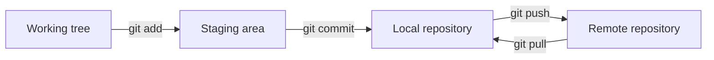
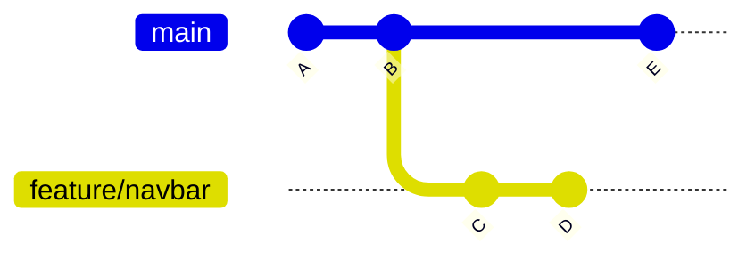
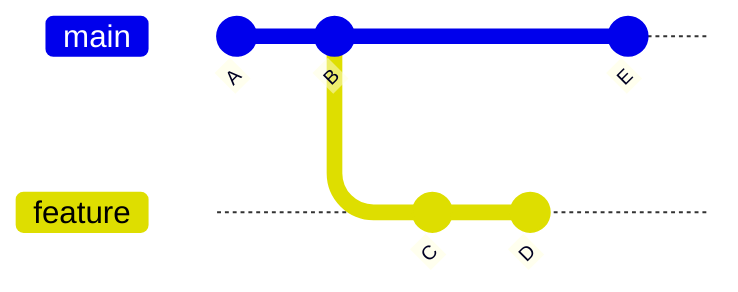

# Git y GitHub

## Introducción

### ¿Qué es Git?

Git es un sistema de control de versiones distribuido creado para registrar cambios en archivos a lo largo del tiempo. Permite que varias personas trabajen sobre un mismo proyecto, manteniendo historial, ramas (branches) de trabajo independientes y mecanismos de integración. En desarrollo web y de software en general, Git es la herramienta base para organizar cambios, colaborar y volver a versiones anteriores cuando hace falta.

### Historia

Git fue creado por Linus Torvalds en 2005 durante el desarrollo del kernel de Linux. Surgió como respuesta a la necesidad de contar con una herramienta rápida, distribuida y confiable para coordinar el trabajo de muchos colaboradores. Desde entonces se convirtió en el estándar de facto para control de versiones en proyectos de software.

### Conceptos Clave

- **Control de versiones**: registra quién cambió qué, cuándo y por qué
- **Distribuido**: cada copia local del repositorio contiene el historial completo
- **Trazabilidad**: cada cambio puede asociarse a un commit con autor, fecha y mensaje
- **Colaboración**: varias personas pueden trabajar en paralelo sin pisarse permanentemente
- **Recuperación**: es posible comparar versiones y volver a estados anteriores del proyecto

### Git no es GitHub

- **Git**: herramienta de control de versiones que corre localmente y también puede conectarse a servidores remotos
- **GitHub**: plataforma web para alojar repositorios (repositories) Git y colaborar mediante issues, pull requests, revisiones y automatizaciones

---

## Modelo Básico de Trabajo

### Definición

Git organiza el trabajo en tres espacios principales: el directorio de trabajo (working tree), el área de preparación (staging area) y el historial del repositorio (repository). Este modelo ayuda a separar cambios en edición, cambios listos para registrar y cambios ya confirmados como parte de la historia del proyecto.

### Conceptos Clave

- **Working tree**: archivos que estás modificando en tu carpeta local
- **Staging area**: área intermedia donde eliges exactamente qué cambios entran al próximo commit
- **Repository**: base de datos local donde Git guarda snapshots, commits, ramas y referencias
- **Remote**: copia del repositorio alojada en otro lugar, por ejemplo GitHub

### Flujo Mínimo

**Linux/macOS (bash)**

```bash
git init
git add .
git commit -m "Initial version"
git remote add origin https://github.com/usuario/proyecto.git
git push -u origin main
```

**Windows (cmd)**

```cmd
git init
git add .
git commit -m "Initial version"
git remote add origin https://github.com/usuario/proyecto.git
git push -u origin main
```

### Diagrama: Flujo Local de Git



---

## Commit

### Definición

Un commit es un registro inmutable de cambios en un momento determinado. Puede pensarse como una "foto" del proyecto, acompañada por metadatos como autor, fecha y mensaje descriptivo. Los commits forman una cadena de historial (history) que permite reconstruir la evolución del código.

### Conceptos Clave

- **Snapshot**: Git guarda el estado de los archivos versionados en ese momento
- **Identificador único**: cada commit tiene un hash que lo distingue
- **Mensaje**: debe explicar el propósito del cambio, no solo lo que se tocó
- **Historial (history)**: los commits permiten revisar, comparar y revertir cambios

### Buenas Prácticas

- **Un commit, una idea**: agrupar cambios relacionados
- **Mensajes claros**: por ejemplo `Add login form validation`
- **Frecuencia razonable**: ni un commit por cada carácter, ni uno gigante con todo mezclado

### Ejemplo

**Linux/macOS (bash)**

```bash
git add src/login.js
git commit -m "Add client-side login validation"
git log --oneline
```

**Windows (cmd)**

```cmd
git add src\login.js
git commit -m "Add client-side login validation"
git log --oneline
```

---

## Rama (Branch)

### Definición

Una rama (branch) es una línea de desarrollo independiente dentro del mismo repositorio (repository). Permite trabajar en una nueva funcionalidad, una corrección o un experimento sin alterar inmediatamente la rama principal.

### Conceptos Clave

- **main branch**: suele ser la rama principal o estable del proyecto
- **Aislamiento**: cada rama (branch) puede avanzar con commits propios
- **Paralelismo**: varias tareas pueden desarrollarse al mismo tiempo
- **Integración posterior**: los cambios de una rama (branch) se incorporan luego mediante merge o rebase

### Ejemplo

**Linux/macOS (bash)**

```bash
git switch -c feature/navbar
git add .
git commit -m "Build navigation bar"
git switch main
```

**Windows (cmd)**

```cmd
git switch -c feature/navbar
git add .
git commit -m "Build navigation bar"
git switch main
```

### Diagrama: Trabajo con Ramas



---

## Merge

### Definición

Merge es la operación que integra los cambios de una rama (branch) en otra. Es la forma más directa de unir historias de desarrollo paralelas. Cuando Git puede combinar los cambios automáticamente, crea un nuevo merge commit; cuando dos cambios compiten sobre la misma parte del archivo, aparecen conflictos (conflicts) que deben resolverse manualmente.

### Conceptos Clave

- **Integración**: une el trabajo de dos ramas (branches)
- **Merge commit**: conserva explícitamente el punto en que dos historias se fusionan
- **Conflictos (conflicts)**: ocurren cuando Git no puede decidir qué versión dejar
- **Historial visible**: deja más explícita la estructura real del trabajo colaborativo

### Ejemplo

**Linux/macOS (bash)**

```bash
git switch main
git merge feature/navbar
```

**Windows (cmd)**

```cmd
git switch main
git merge feature/navbar
```

### Ejemplo de conflicto

```text
<<<<<<< HEAD
const apiUrl = '/api/v1';
=======
const apiUrl = '/api/v2';
>>>>>>> feature/update-api
```

Git marca ambas versiones para que una persona decida cuál conservar o cómo combinarlas.

---

## Rebase

### Definición

Rebase reescribe la base de una rama (branch) para que sus commits parezcan construidos encima de otra referencia más reciente. Se usa para mantener un historial más lineal, aplicando nuevamente commits existentes sobre una nueva base.

### Conceptos Clave

- **Historial lineal**: evita merge commits innecesarios en algunos flujos de trabajo
- **Reescritura de historial**: cambia hashes de commits ya existentes
- **Uso local**: conviene principalmente sobre ramas (branches) propias que todavía no fueron compartidas ampliamente
- **Precaución**: no debería usarse livianamente sobre historial público que otros ya descargaron

### Merge vs Rebase

- **Merge**: preserva la historia tal como ocurrió, incluyendo la bifurcación y la unión
- **Rebase**: reordena la historia para que parezca lineal
- **Regla práctica**: merge prioriza fidelidad histórica; rebase prioriza limpieza visual del historial

### Ejemplo

**Linux/macOS (bash)**

```bash
git switch feature/navbar
git rebase main
```

**Windows (cmd)**

```cmd
git switch feature/navbar
git rebase main
```

### Diagrama: Rebase



Después del rebase, los commits `C` y `D` se reaplican encima de `E`, generando nuevos commits equivalentes.

---

## GitHub

### Definición

GitHub es una plataforma de alojamiento y colaboración para repositorios Git. Además de guardar código en repositorios remotos, agrega funcionalidades orientadas al trabajo en equipo: revisión de cambios, discusión, documentación, seguimiento de issues, automatización y despliegue. Es un servicio que facilita el uso de git para equipos distribuidos. Existen otros proveedores similares como Gitlab, BitBucket, Azure, Google Cloud Repos, etc.

### Conceptos Clave

- **Repositorio remoto (remote repository)**: copia compartida accesible por Internet
- **Colaboración**: varias personas pueden clonar, proponer y revisar cambios
- **Visibilidad**: proyectos públicos o privados
- **Ecosistema**: issues, projects, actions, releases, wiki y pull requests

### Operaciones comunes

**Linux/macOS (bash)**

```bash
git clone https://github.com/usuario/proyecto.git
git pull origin main
git push origin feature/navbar
```

**Windows (cmd)**

```cmd
git clone https://github.com/usuario/proyecto.git
git pull origin main
git push origin feature/navbar
```

---

## Pull Request

### Definición

Un pull request (PR) es una propuesta de integración de cambios entre ramas (branches) en plataformas como GitHub. No es un comando de Git en sí mismo, sino una capa de colaboración sobre Git. Sirve para revisar código, discutir decisiones técnicas, ejecutar validaciones automáticas y aprobar cambios antes de integrarlos a la rama principal.

### Conceptos Clave

- **Comparación de ramas (branches)**: por ejemplo `feature/navbar` hacia `main`
- **Revisión**: otras personas pueden comentar líneas específicas y pedir ajustes
- **Aprobación**: el cambio puede requerir una o más revisiones favorables
- **CI/CD**: se pueden ejecutar tests y checks automáticos antes del merge
- **Trazabilidad**: queda registro de la discusión y de la decisión de integrar el cambio

### Flujo típico en GitHub

1. Crear una rama para una tarea.
2. Hacer commits pequeños y claros.
3. Publicar la rama con `git push`.
4. Abrir un pull request en GitHub.
5. Recibir comentarios, ajustar y volver a subir commits.
6. Hacer merge del pull request cuando esté aprobado.

### Ejemplo

**Linux/macOS (bash)**

```bash
git switch -c feature/readme-git
git add Git.md
git commit -m "Add Git and GitHub appendix"
git push -u origin feature/readme-git
```

**Windows (cmd)**

```cmd
git switch -c feature/readme-git
git add Git.md
git commit -m "Add Git and GitHub appendix"
git push -u origin feature/readme-git
```

Luego, desde GitHub, se abre un pull request desde `feature/readme-git` hacia `main`.

---

## Fork

### Definición

Un fork es una copia de un repositorio en tu propia cuenta de GitHub. Se usa mucho en proyectos donde no tienes permisos de escritura directos sobre el repositorio original (upstream repository), porque te permite proponer cambios desde tu copia y luego enviarlos mediante pull request.

### Conceptos Clave

- **Fork**: copia del repositorio original en tu cuenta
- **Upstream**: repositorio original del que nació tu fork
- **Origin**: repositorio remoto asociado a tu fork
- **Contribución externa**: flujo típico para colaborar en proyectos open source
- **Sincronización**: mantener tu fork actualizado con cambios de `upstream`

### Flujo típico con fork

1. Hacer fork del repositorio desde la interfaz de GitHub.
2. Clonar tu fork localmente.
3. Agregar el remoto `upstream` para traer cambios del repositorio original.
4. Crear una rama (branch), hacer commits y subirlos a tu fork.
5. Abrir un pull request desde tu fork hacia el repositorio original.

### Ejemplo de sincronización de fork

**Linux/macOS (bash)**

```bash
git clone https://github.com/tu-usuario/proyecto.git
cd proyecto
git remote add upstream https://github.com/organizacion/proyecto.git
git fetch upstream
git switch main
git merge upstream/main
git push origin main
```

**Windows (cmd)**

```cmd
git clone https://github.com/tu-usuario/proyecto.git
cd proyecto
git remote add upstream https://github.com/organizacion/proyecto.git
git fetch upstream
git switch main
git merge upstream/main
git push origin main
```

---

## Convenciones de Git

### Estrategia de ramas (branching strategy)

Mantener una rama principal estable (`main`) y crear ramas cortas por tarea (`feature/*`, `fix/*`). Esto reduce conflictos y facilita revisiones.

**Ejemplo corto**

```text
main
feature/login-form
fix/navbar-mobile
```

### Convenciones de commits

Usar mensajes breves, en imperativo y con prefijo consistente para entender el historial rápidamente.

**Ejemplo corto**

```text
feat: add login form validation
fix: correct mobile navbar overlap
docs: update Git appendix
```

### Resolución de conflictos

Cuando aparezcan conflictos (conflicts), resolver el archivo manualmente, probar y recién después continuar el merge o rebase.

**Ejemplo corto**

**Linux/macOS (bash)**

```bash
git status
git add .
git commit
```

**Windows (cmd)**

```cmd
git status
git add .
git commit
```

### Protección de rama principal

La rama `main` debería tener reglas de protección: sin push directo, pull request obligatorio y al menos una aprobación.

**Ejemplo corto**

```text
main branch protection:
- Require a pull request before merging
- Require at least 1 approval
- Block direct pushes
```

---

## Resumen

- **Git** resuelve el control de versiones y el trabajo distribuido.
- **Commit** registra una unidad de cambio en el historial.
- **Rama (branch)** permite trabajar en paralelo sin mezclar todo desde el inicio.
- **Merge** integra historias de ramas distintas.
- **Rebase** reordena commits sobre una base más nueva para linealizar historial.
- **GitHub** facilita colaboración remota multiusuario sobre repositorios Git.
- **Fork** permite proponer cambios desde una copia propia del repositorio original.
- **Pull request** formaliza la revisión y la integración de cambios.

Este apéndice funciona como preconcepto para entender cómo se organiza el trabajo práctico en proyectos reales y por qué casi cualquier flujo moderno de desarrollo web está atravesado por Git y GitHub.