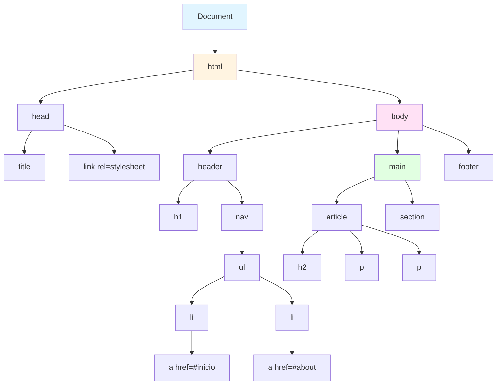
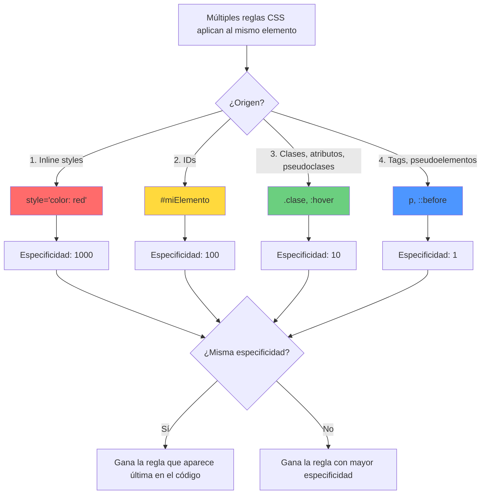
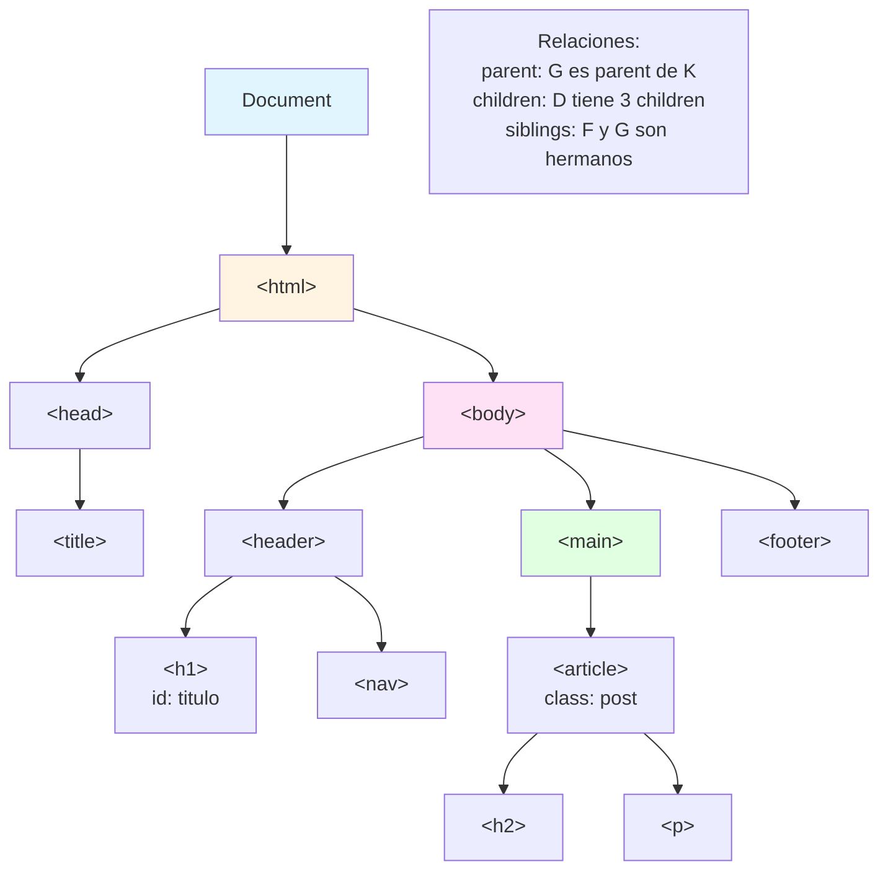
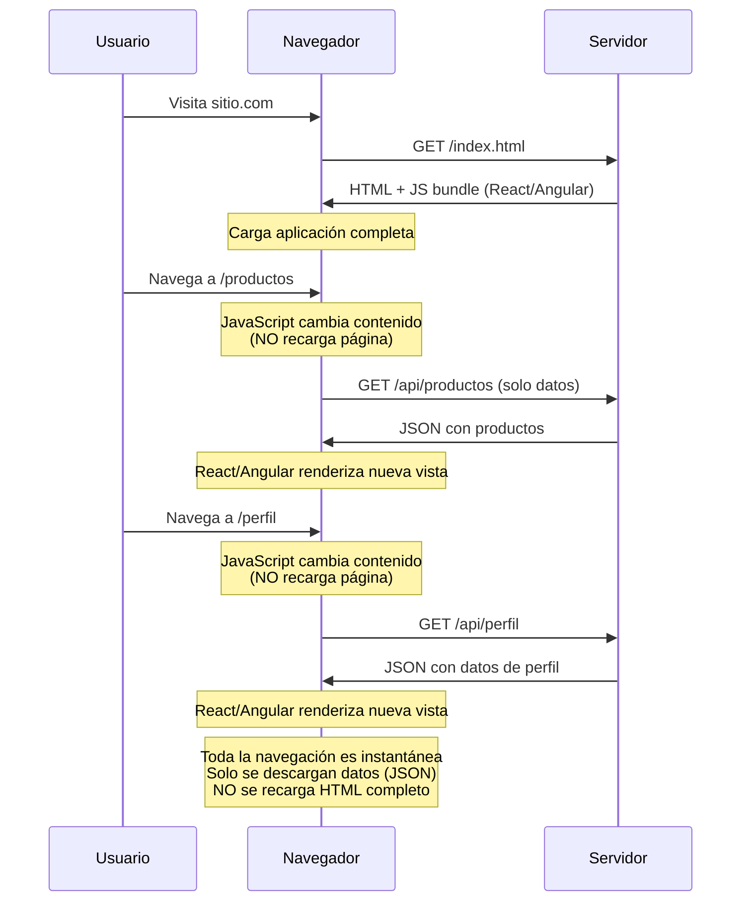

# Hipertexto

## Definición

El hipertexto es un sistema de organización de información donde los documentos están interconectados mediante enlaces (links o hipervínculos) que permiten navegación no lineal. A diferencia de texto tradicional (lineal, secuencial), el hipertexto permite al lector elegir su propio camino entre documentos relacionados. En la Web, HTML (HyperText Markup Language) es el lenguaje estándar para crear documentos hipertextuales.

## Conceptos Clave

- **Enlace/Hipervínculo**: Referencia de un documento a otro (o a una sección dentro del mismo), navegable mediante clic
- **Nodo**: Cada documento o recurso en la red de hipertexto
- **Navegación no lineal**: El lector decide el orden de lectura, no hay secuencia fija como en un libro
- **World Wide Web**: La implementación más exitosa de hipertexto, combinando HTML, HTTP y URLs

---

## HTML

### Definición

HTML (HyperText Markup Language) es el lenguaje de marcado estándar para crear documentos web. Define la estructura y semántica del contenido mediante etiquetas (tags) que encierran elementos: párrafos, encabezados, enlaces, imágenes, formularios, etc. HTML describe *qué es* cada parte del contenido (semántica), no *cómo se ve* (eso es CSS). Los navegadores interpretan HTML y construyen el DOM (Document Object Model).

### Conceptos Clave

- **Etiquetas (tags)**: Bloques de construcción HTML; la mayoría tienen apertura `<tag>` y cierre `</tag>`
- **Elementos**: Tag + contenido + tag cierre (ej: `<p>Texto</p>`)
- **Atributos**: Información adicional en tags (ej: `<a href="url">`, ``)
- **Estructura jerárquica**: Elementos anidados forman árbol (DOM tree)
- **Semántica**: Tags descriptivos (`<header>`, `<nav>`, `<article>`) vs genéricos (`<div>`, `<span>`)
- **HTML5**: Versión actual (2014), incluye APIs JavaScript (Canvas, Video, Geolocation, etc.)

### Ejemplo: Documento HTML básico

```html
<!DOCTYPE html>
<html lang="es">
<head>
    <meta charset="UTF-8">
    <meta name="viewport" content="width=device-width, initial-scale=1.0">
    <title>Mi Primera Página</title>
    <link rel="stylesheet" href="styles.css">
</head>
<body>
    <!-- Encabezado de la página -->
    <header>
        <h1>Bienvenidos a la UTN</h1>
        <nav>
            <ul>
                <li><a href="#inicio">Inicio</a></li>
                <li><a href="#about">Sobre nosotros</a></li>
                <li><a href="#contacto">Contacto</a></li>
            </ul>
        </nav>
    </header>
    
    <!-- Contenido principal -->
    <main>
        <article id="inicio">
            <h2>Desarrollo de Software</h2>
            <p>Este curso cubre <strong>frontend</strong> y <strong>backend</strong> con tecnologías modernas.</p>
            <p>Aprenderemos HTML, CSS, JavaScript y <em>React</em>.</p>
        </article>
        
        <section id="about">
            <h2>Sobre el Curso</h2>
            <p>Contenido teórico-práctico para ingenieros en sistemas.</p>
            
        </section>
        
        <!-- Formulario -->
        <section id="contacto">
            <h2>Contacto</h2>
            <form action="/submit" method="POST">
                <label for="nombre">Nombre:</label>
                <input type="text" id="nombre" name="nombre" required>
                
                <label for="email">Email:</label>
                <input type="email" id="email" name="email" required>
                
                <label for="mensaje">Mensaje:</label>
                <textarea id="mensaje" name="mensaje" rows="4"></textarea>
                
                <button type="submit">Enviar</button>
            </form>
        </section>
    </main>
    
    <!-- Pie de página -->
    <footer>
        <p>&copy; 2026 UTN - Universidad Tecnológica Nacional</p>
    </footer>
    
    <script src="app.js"></script>
</body>
</html>
```

### Tags HTML más comunes

```html
<!-- Estructura -->
<html>, <head>, <body>, <header>, <nav>, <main>, <section>, <article>, <aside>, <footer>

<!-- Texto -->
<h1> a <h6>     <!-- Encabezados (h1 más importante) -->
<p>             <!-- Párrafo -->
<span>          <!-- Contenedor inline genérico -->
<div>           <!-- Contenedor block genérico -->
<strong>        <!-- Texto importante (bold) -->
<em>            <!-- Énfasis (itálica) -->
<br>            <!-- Salto de línea -->

<!-- Enlaces e imágenes -->
<a href="url">Texto del enlace</a>


<!-- Listas -->
<ul>            <!-- Lista desordenada (bullets) -->
  <li>Item 1</li>
  <li>Item 2</li>
</ul>

<ol>            <!-- Lista ordenada (números) -->
  <li>Primero</li>
  <li>Segundo</li>
</ol>

<!-- Formularios -->
<form action="/submit" method="POST">
  <input type="text" name="campo">
  <input type="email" name="email">
  <input type="password" name="pass">
  <textarea name="mensaje"></textarea>
  <button type="submit">Enviar</button>
</form>

<!-- Tablas -->
<table>
  <thead>
    <tr><th>Columna 1</th><th>Columna 2</th></tr>
  </thead>
  <tbody>
    <tr><td>Dato 1</td><td>Dato 2</td></tr>
  </tbody>
</table>
```

### Diagrama: Árbol DOM (Document Object Model)



**Explicación del DOM:**
- El DOM es la representación en memoria del HTML como árbol de nodos
- JavaScript puede manipular el DOM para cambiar contenido dinámicamente
- Cada tag HTML se convierte en un nodo del árbol
- Los nodos tienen relaciones: parent (padre), children (hijos), siblings (hermanos)

---

## CSS

### Definición

CSS (Cascading Style Sheets) es el lenguaje de hojas de estilo que define la presentación visual de documentos HTML: colores, fuentes, espaciado, layout, animaciones, etc. Separa presentación (CSS) de contenido (HTML), permitiendo mantener y reutilizar estilos. "Cascading" se refiere a cómo se resuelven conflictos entre reglas mediante especificidad y orden.

### Conceptos Clave

- **Selectores**: Patrones que identifican qué elementos HTML aplicar estilos (ej: `h1`, `.clase`, `#id`)
- **Propiedades y valores**: `color: blue;`, `font-size: 16px;`, `margin: 10px;`
- **Cascada**: Múltiples reglas pueden aplicar al mismo elemento; especificidad y orden determinan cuál gana
- **Especificidad**: Prioridad de selectores: inline styles > IDs > clases > tags
- **Box Model**: Todo elemento es una caja con content, padding, border, margin
- **Layout**: Flexbox (1-dimensional) y Grid (2-dimensional) para posicionar elementos

### Ejemplo: CSS básico

```css
/* Selector de tag */
body {
    font-family: Arial, sans-serif;
    line-height: 1.6;
    margin: 0;
    padding: 0;
    background-color: #f4f4f4;
}

/* Selector de tag anidado */
header h1 {
    color: #333;
    text-align: center;
    margin: 20px 0;
}

/* Selector de clase (inicia con .) */
.boton {
    background-color: #007bff;
    color: white;
    padding: 10px 20px;
    border: none;
    border-radius: 5px;
    cursor: pointer;
}

.boton:hover {
    background-color: #0056b3;  /* Cambia color al pasar mouse */
}

/* Selector de ID (inicia con #) */
#contacto {
    background-color: white;
    padding: 20px;
    margin: 20px;
    border-radius: 8px;
    box-shadow: 0 2px 4px rgba(0,0,0,0.1);
}

/* Múltiples selectores */
h1, h2, h3 {
    font-weight: bold;
    color: #2c3e50;
}

/* Combinador descendiente */
nav ul li {
    display: inline-block;
    margin: 0 10px;
}

nav ul li a {
    text-decoration: none;
    color: #007bff;
}

/* Pseudoclase */
a:visited {
    color: #6c757d;
}
```

### Box Model

```
┌─────────────────────────────────┐
│         Margin (transparente)   │  ← Espacio fuera del elemento
│  ┌───────────────────────────┐  │
│  │  Border (visible)         │  │  ← Borde del elemento
│  │  ┌─────────────────────┐  │  │
│  │  │  Padding (fondo)    │  │  │  ← Espacio interno
│  │  │  ┌───────────────┐  │  │  │
│  │  │  │   Content     │  │  │  │  ← Contenido real (texto, img)
│  │  │  │   width/height│  │  │  │
│  │  │  └───────────────┘  │  │  │
│  │  └─────────────────────┘  │  │
│  └───────────────────────────┘  │
└─────────────────────────────────┘
```

### Ejemplo: Flexbox (Layout 1D)

```html
<div class="container">
    <div class="item">Item 1</div>
    <div class="item">Item 2</div>
    <div class="item">Item 3</div>
</div>
```

```css
.container {
    display: flex;                 /* Activa Flexbox */
    justify-content: space-between; /* Distribución horizontal */
    align-items: center;           /* Alineación vertical */
    gap: 20px;                     /* Espacio entre items */
    padding: 20px;
}

.item {
    background-color: #007bff;
    color: white;
    padding: 20px;
    border-radius: 5px;
    flex: 1;  /* Cada item ocupa espacio igual */
}
```

### Ejemplo: Grid (Layout 2D)

```css
.grid-container {
    display: grid;
    grid-template-columns: repeat(3, 1fr);  /* 3 columnas iguales */
    grid-gap: 20px;
    padding: 20px;
}

.grid-item {
    background-color: #28a745;
    color: white;
    padding: 30px;
    text-align: center;
    border-radius: 8px;
}

/* Layout responsive: 1 columna en móviles */
@media (max-width: 768px) {
    .grid-container {
        grid-template-columns: 1fr;
    }
}
```

### Diagrama: Cascada y Especificidad CSS



**Ejemplo de especificidad:**
```css
/* Especificidad: 1 (tag) */
p { color: black; }

/* Especificidad: 10 (clase) */
.texto { color: blue; }

/* Especificidad: 100 (ID) */
#importante { color: red; }

/* Especificidad: 1000 (inline - más alta) */
/* <p style="color: green;">Texto</p> */

/* ¿Qué color tendrá esto? */
<p class="texto" id="importante">Texto</p>
<!-- Respuesta: rojo (ID tiene mayor especificidad que clase) -->
```

---

## JavaScript

### Definición

JavaScript (JS) es un lenguaje de programación dinámico, interpretado, orientado a objetos (basado en prototipos) y con tipado débil. Originalmente creado para agregar interactividad a páginas web (validación de formularios, animaciones), hoy es un lenguaje de propósito general usado tanto en navegadores (frontend) como en servidores (Node.js backend). Es el único lenguaje que los navegadores ejecutan nativamente.

### Conceptos Clave

- **Tipado dinámico**: Las variables no tienen tipo fijo; pueden cambiar de tipo en tiempo de ejecución (similar a Python, diferente a C)
- **First-class functions**: Las funciones son valores que pueden asignarse a variables, pasarse como argumentos, retornarse
- **Event-driven**: El código responde a eventos (clicks, teclas, carga de página) mediante callbacks
- **Asíncrono**: Operaciones no bloqueantes con Promises y async/await
- **DOM manipulation**: Puede modificar HTML/CSS dinámicamente mediante APIs del navegador
- **ECMAScript**: Estándar del lenguaje; versiones modernas (ES6/ES2015+) agregaron clases, arrow functions, destructuring, modules

### Ejemplo: Variables y tipos

```javascript
// Declaración de variables
let nombre = "Juan";           // String (texto)
let edad = 20;                 // Number (entero o decimal)
let aprobado = true;           // Boolean
let materias = ["Prog", "BD"]; // Array
let estudiante = {             // Object
    nombre: "Ana",
    edad: 21,
    carrera: "Sistemas"
};

// Tipos dinámicos (puede cambiar)
let variable = 42;      // Number
variable = "texto";     // Ahora es String
variable = true;        // Ahora es Boolean

// const: valor constante (no puede reasignarse)
const PI = 3.14159;
// PI = 3; // ❌ Error: no se puede reasignar

// var: forma antigua (evitar, usar let/const)
var legado = "antiguo";
```

**Comparación con Python y C:**
```python
# Python (tipado dinámico, similar a JS)
nombre = "Juan"          # str
edad = 20                # int
aprobado = True          # bool
materias = ["Prog", "BD"] # list
estudiante = {           # dict
    "nombre": "Ana",
    "edad": 21
}
```

```c
// C (tipado estático, diferente a JS)
char nombre[] = "Juan";      // Tipo fijo: array de char
int edad = 20;               // Tipo fijo: int
bool aprobado = true;        // Tipo fijo: bool
// No hay arrays dinámicos ni diccionarios nativos en C
```

### Ejemplo: Funciones

```javascript
// Declaración de función tradicional
function sumar(a, b) {
    return a + b;
}

let resultado = sumar(5, 3);  // 8

// Arrow function (ES6) - sintaxis moderna
const multiplicar = (a, b) => {
    return a * b;
};

// Arrow function simplificada (return implícito)
const dividir = (a, b) => a / b;

// Función como valor (first-class function)
const operaciones = [sumar, multiplicar, dividir];
operaciones[0](10, 2);  // sumar(10, 2) = 12

// Callback (función pasada como argumento)
function procesarNumeros(num1, num2, operacion) {
    return operacion(num1, num2);
}

procesarNumeros(8, 4, sumar);        // 12
procesarNumeros(8, 4, multiplicar);  // 32

// Funciones de array (usan callbacks)
const numeros = [1, 2, 3, 4, 5];

// map: transforma cada elemento
const dobles = numeros.map(num => num * 2);  // [2, 4, 6, 8, 10]

// filter: filtra elementos
const pares = numeros.filter(num => num % 2 === 0);  // [2, 4]

// reduce: acumula valores
const suma = numeros.reduce((acc, num) => acc + num, 0);  // 15
```

**Comparación con Python:**
```python
# Python también tiene funciones first-class
def sumar(a, b):
    return a + b

# Lambda (similar a arrow function)
multiplicar = lambda a, b: a * b

# Callbacks y funciones de array
numeros = [1, 2, 3, 4, 5]
dobles = list(map(lambda x: x * 2, numeros))      # [2, 4, 6, 8, 10]
pares = list(filter(lambda x: x % 2 == 0, numeros)) # [2, 4]
```

### Ejemplo: Manipulación del DOM

```javascript
// Seleccionar elementos
const titulo = document.querySelector('h1');
const botones = document.querySelectorAll('.boton');
const formulario = document.getElementById('miForm');

// Modificar contenido
titulo.textContent = '¡Título nuevo!';
titulo.innerHTML = '<span>Título con HTML</span>';

// Modificar estilos
titulo.style.color = 'blue';
titulo.style.fontSize = '32px';

// Agregar/quitar clases
titulo.classList.add('destacado');
titulo.classList.remove('viejo');
titulo.classList.toggle('activo');  // Si existe, la quita; si no, la agrega

// Crear elementos nuevos
const parrafo = document.createElement('p');
parrafo.textContent = 'Nuevo párrafo dinámico';
parrafo.className = 'texto';
document.body.appendChild(parrafo);

// Eventos
const boton = document.querySelector('#miBoton');

boton.addEventListener('click', function() {
    alert('¡Botón clickeado!');
});

// Event listener con arrow function
boton.addEventListener('click', () => {
    console.log('Click detectado');
});

// Evento de formulario
formulario.addEventListener('submit', (event) => {
    event.preventDefault();  // Evita que el form se envíe y recargue la página
    
    const nombre = document.querySelector('#nombre').value;
    const email = document.querySelector('#email').value;
    
    console.log('Datos:', {nombre, email});
    
    // Aquí harías un fetch() para enviar datos al servidor
});
```

### Ejemplo: Asincronía con Promises

```javascript
// Simular una petición a una API (asíncrona)
function obtenerUsuarios() {
    return fetch('https://api.example.com/users')
        .then(response => {
            if (!response.ok) {
                throw new Error('Error en la petición');
            }
            return response.json();
        })
        .then(usuarios => {
            console.log('Usuarios:', usuarios);
            return usuarios;
        })
        .catch(error => {
            console.error('Error:', error);
        });
}

// Sintaxis moderna: async/await (equivalente pero más legible)
async function obtenerUsuariosAsync() {
    try {
        const response = await fetch('https://api.example.com/users');
        
        if (!response.ok) {
            throw new Error('Error en la petición');
        }
        
        const usuarios = await response.json();
        console.log('Usuarios:', usuarios);
        return usuarios;
        
    } catch (error) {
        console.error('Error:', error);
    }
}

// Uso
obtenerUsuariosAsync();
console.log('Esto se ejecuta antes de que llegue la respuesta');
```

**Comparación con Python:**
```python
# Python también tiene async/await
import asyncio
import aiohttp

async def obtener_usuarios():
    async with aiohttp.ClientSession() as session:
        async with session.get('https://api.example.com/users') as response:
            if response.status == 200:
                usuarios = await response.json()
                print('Usuarios:', usuarios)
                return usuarios
            else:
                print('Error en la petición')

# Ejecutar
asyncio.run(obtener_usuarios())
```

### Diagrama: Event Bubbling (Propagación de Eventos)

```mermaid
graph TB
    A[document] --> B[html]
    B --> C[body]
    C --> D[div.container]
    D --> E[button]
    
    E -.Click!.-> F[1. Capturing Phase<br/>document → button]
    F --> G[2. Target Phase<br/>button ejecuta handler]
    G --> H[3. Bubbling Phase<br/>button → document]
    
    style E fill:#ff6b6b
    style G fill:#ffd93d
    style H fill:#6bcf7f
    
    I[addEventListener options<br/>{capture: true/false}]
    
    J[Por default, eventos<br/>se escuchan en bubbling]
```

**Ejemplo de Event Bubbling:**
```html
<div id="padre" style="padding: 50px; background: lightblue;">
    Padre
    <button id="hijo">Hijo (Click aquí)</button>
</div>
```

```javascript
const padre = document.getElementById('padre');
const hijo = document.getElementById('hijo');

// Ambos ejecutarán cuando clickees el botón
padre.addEventListener('click', () => {
    console.log('Click en padre');
});

hijo.addEventListener('click', (event) => {
    console.log('Click en hijo');
    // event.stopPropagation();  // Descomentar para detener bubbling
});

// Salida al clickear el botón:
// Click en hijo
// Click en padre  ← El evento "burbujea" hacia arriba
```

---

## Document Object Model (DOM)

### Definición

El DOM (Document Object Model) es una representación en árbol de la estructura HTML de una página web, accesible y manipulable mediante JavaScript. El navegador crea el DOM al parsear el HTML; cada elemento HTML se convierte en un nodo (node) del árbol. JavaScript puede acceder, modificar, crear y eliminar nodos dinámicamente, permitiendo actualizar la página sin recargar. El DOM es la interfaz entre HTML (estructura estática) y JavaScript (comportamiento dinámico).

### Conceptos Clave

- **Árbol de nodos**: El DOM tiene forma de árbol jerárquico; cada nodo puede tener parent (padre), children (hijos), siblings (hermanos)
- **Nodos de elementos vs nodos de texto**: Elementos HTML son nodos; el texto dentro también es un nodo separado
- **Document object**: El objeto raíz del DOM; accesible globalmente como `document`
- **Métodos de selección**: `getElementById()`, `querySelector()`, `querySelectorAll()` para encontrar elementos
- **Propiedades y métodos**: Acceso a atributos (`element.id`), contenido (`textContent`, `innerHTML`), estilos (`style`), etc.
- **Event listeners**: Asociar funciones a eventos de elementos para reaccionar a acciones del usuario

### Ejemplo: Estructura y acceso básico

```html
<!-- HTML original -->
<html>
    <head>
        <title>Mi Página</title>
    </head>
    <body>
        <header>
            <h1 id="titulo">Bienvenido</h1>
            <nav>
                <ul>
                    <li><a href="#inicio">Inicio</a></li>
                    <li><a href="#sobre">Sobre</a></li>
                </ul>
            </nav>
        </header>
        <main>
            <article class="post">
                <h2>Primer Artículo</h2>
                <p>Contenido aquí</p>
            </article>
        </main>
    </body>
</html>
```

**Árbol DOM resultante:**
```
Document
├─ DocumentType (<!DOCTYPE html>)
└─ <html>
   ├─ <head>
   │  └─ <title>
   │     └─ Text: "Mi Página"
   └─ <body>
      ├─ <header>
      │  ├─ <h1 id="titulo">
      │  │  └─ Text: "Bienvenido"
      │  └─ <nav>
      │     └─ <ul>
      │        ├─ <li>
      │        │  └─ <a>
      │        │     └─ Text: "Inicio"
      │        └─ <li>
      │           └─ <a>
      │              └─ Text: "Sobre"
      └─ <main>
         └─ <article class="post">
            ├─ <h2>
            │  └─ Text: "Primer Artículo"
            └─ <p>
               └─ Text: "Contenido aquí"
```

**Acceso a elementos desde JavaScript:**
```javascript
// Seleccionar por ID
const titulo = document.getElementById('titulo');
console.log(titulo.textContent);  // "Bienvenido"

// Seleccionar por clase
const posts = document.querySelectorAll('.post');
console.log(posts.length);  // 1

// Seleccionar usando selectores CSS
const primeraLi = document.querySelector('nav li');
console.log(primeraLi.textContent);  // "Inicio"

// Acceder al parent
const articulo = document.querySelector('article');
const main = articulo.parentElement;
console.log(main.tagName);  // "MAIN"

// Acceder a los hijos
const header = document.querySelector('header');
const hijos = header.children;  // HTMLCollection de todos los hijos
console.log(hijos.length);  // 2 (h1 y nav)

// Acceder a hermanos
const nav = document.querySelector('nav');
const hermanoAnterior = nav.previousElementSibling;  // h1
const proximoHermano = nav.nextElementSibling;  // null (no hay)
```

### Ejemplo: Manipulación de contenido

```javascript
// Cambiar texto
const titulo = document.getElementById('titulo');
titulo.textContent = '¡Hola, UTN!';

// Cambiar HTML completo (cuidado con inyección XSS)
const articulo = document.querySelector('article');
articulo.innerHTML = '<h2>Nuevo Título</h2><p>Nuevo contenido</p>';

// Agregar contenido al final
const main = document.querySelector('main');
const parrafo = document.createElement('p');
parrafo.textContent = 'Párrafo agregado dinámicamente';
main.appendChild(parrafo);

// Insertar contenido en posición específica
const main = document.querySelector('main');
const nuevaImg = document.createElement('img');
nuevaImg.src = 'imagen.jpg';
// Insertar como primer hijo
main.insertBefore(nuevaImg, main.firstChild);

// Eliminar elemento
const nav = document.querySelector('nav');
nav.remove();  // O nav.parentElement.removeChild(nav);

// Reemplazar elemento
const antiguo = document.getElementById('titulo');
const nuevo = document.createElement('h1');
nuevo.id = 'titulo';
nuevo.textContent = 'Nuevo Título';
antiguo.replaceWith(nuevo);
```

### Ejemplo: Atributos y clases

```javascript
const elemento = document.querySelector('article');

// Acceder a atributos
console.log(elemento.id);  // ""
console.log(elemento.className);  // "post"
console.log(elemento.getAttribute('data-autor'));  // Si existe

// Establecer atributos
elemento.id = 'articulo-1';
elemento.setAttribute('data-fecha', '2026-03-06');
elemento.setAttribute('disabled', '');  // Atributo booleano

// Remover atributos
elemento.removeAttribute('data-fecha');

// Verificar atributo
if (elemento.hasAttribute('data-autor')) {
    console.log('Tiene atributo data-autor');
}

// Trabajar con clases
elemento.classList.add('destacado');  // Agregar clase
elemento.classList.remove('post');     // Quitar clase
elemento.classList.toggle('activo');   // Alternar clases
elemento.classList.contains('destacado');  // true

// Reemplazar clases
elemento.classList.replace('viejo', 'nuevo');
```

### Ejemplo: Estilos dinámicos

```javascript
const elemento = document.querySelector('h1');

// Cambiar estilos individuales
elemento.style.color = 'blue';
elemento.style.fontSize = '32px';
elemento.style.backgroundColor = '#f0f0f0';
elemento.style.padding = '20px';

// Acceder a estilos computados (estilos aplicados finalmente)
const elemento = document.querySelector('p');
const estiloComputado = window.getComputedStyle(elemento);
console.log(estiloComputado.color);  // rgb(0, 0, 0) (o lo que sea)
console.log(estiloComputado.fontSize);  // 16px

// Mejor: usar clases CSS en lugar de estilos inline
// HTML: <style>.activo { color: blue; font-size: 32px; }</style>
// JavaScript:
elemento.classList.add('activo');  // ✅ Separación HTML/CSS/JS
// en lugar de:
// elemento.style.color = 'blue'; elemento.style.fontSize = '32px'; ❌
```

### Ejemplo: Event Listeners (Escuchadores de Eventos)

```javascript
const boton = document.querySelector('button');

// Escuchar clicks
boton.addEventListener('click', function(event) {
    console.log('Botón clickeado');
    console.log(event.target);  // El elemento que disparó el evento
});

// Escuchar con arrow function
boton.addEventListener('click', () => {
    console.log('Click nuevamente');
});

// Escuchar cambios en input
const input = document.querySelector('input');
input.addEventListener('input', (event) => {
    console.log('Valor actual:', event.target.value);
});

// Escuchar cambios de checkbox
const checkbox = document.querySelector('input[type="checkbox"]');
checkbox.addEventListener('change', (event) => {
    console.log('Checked:', event.target.checked);
});

// Escuchar envío de formulario
const form = document.querySelector('form');
form.addEventListener('submit', (event) => {
    event.preventDefault();  // Evitar que se recargue la página
    console.log('Formulario enviado');
    // Procesar datos del formulario aquí
});

// Eventos de teclado
document.addEventListener('keydown', (event) => {
    console.log('Tecla presionada:', event.key);
    if (event.key === 'Enter') {
        console.log('Enter presionado');
    }
});

// Eventos del mouse
elemento.addEventListener('mouseenter', () => {
    console.log('Mouse entró al elemento');
});

elemento.addEventListener('mouseleave', () => {
    console.log('Mouse salió del elemento');
});

elemento.addEventListener('mousemove', (event) => {
    console.log('Posición X:', event.clientX);
    console.log('Posición Y:', event.clientY);
});
```

### Ejemplo: Búsqueda y filtrado de elementos

```javascript
// Buscar todos los párrafos
const parrafos = document.querySelectorAll('p');
console.log(parrafos.length);

// Iterar sobre los resultados
parrafos.forEach((p, index) => {
    console.log(`Párrafo ${index}:`, p.textContent);
    p.style.color = 'blue';
});

// Buscar elementos dentro de un contenedor específico
const main = document.querySelector('main');
const articulosEnMain = main.querySelectorAll('article');

// Buscar el primer elemento que cumple condición
const primerLink = document.querySelector('a');

// Buscar todos los elementos con un atributo específico
const elementosConData = document.querySelectorAll('[data-autor]');
elementosConData.forEach(el => {
    console.log('Autor:', el.getAttribute('data-autor'));
});
```

### Diagrama: Jerarquía y Relaciones en el DOM



---

## Frameworks y Librerías

### Definición

Los frameworks y librerías JavaScript son herramientas que facilitan el desarrollo de aplicaciones web complejas, proporcionando estructura, patrones y funcionalidades pre-construidas. Una **librería** (como React) es una colección de funciones que tú controlas y llamas cuando necesitas; un **framework** (como Angular) es una estructura más opinionada que controla el flujo de tu aplicación. Ambos solucionan problemas comunes: gestión de estado, renderizado eficiente, componentes reutilizables.

### Conceptos Clave

- **Component-based**: La UI se divide en componentes reutilizables e independientes (similar a funciones pero para UI)
- **State management**: Gestión del estado de la aplicación (datos que cambian) de forma predecible
- **Virtual DOM**: Representación en memoria del DOM real; se calcula qué cambió y solo se actualiza eso (más eficiente)
- **Reactividad**: La UI se actualiza automáticamente cuando los datos cambian
- **SPA (Single Page Application)**: Una sola página HTML; el contenido cambia dinámicamente sin recargar

### ¿Por qué usar frameworks?

**Problema: JS Vanilla (sin frameworks)**
```javascript
// Actualizar UI manualmente es tedioso y propenso a errores
let contador = 0;

function incrementar() {
    contador++;
    // Debes acordarte de actualizar TODOS los lugares que muestran el contador
    document.getElementById('contador1').textContent = contador;
    document.getElementById('contador2').textContent = contador;
    document.querySelector('.total').textContent = `Total: ${contador}`;
    // Si olvidas uno, la UI queda inconsistente
}
```

**Solución: Con React (ejemplo simplificado)**
```javascript
function Contador() {
    const [contador, setContador] = useState(0);
    
    // La UI se actualiza automáticamente cuando contador cambia
    return (
        <div>
            <p id="contador1">{contador}</p>
            <p id="contador2">{contador}</p>
            <p className="total">Total: {contador}</p>
            <button onClick={() => setContador(contador + 1)}>
                Incrementar
            </button>
        </div>
    );
}
```

### Angular

#### Definición
Angular es un framework completo (full-featured) de Google para construir SPAs complejas, especialmente aplicaciones empresariales. Es opinionado (te impone estructura), usa TypeScript obligatoriamente, incluye todo lo necesario (routing, HTTP, forms, testing) sin librerías externas. Tiene curva de aprendizaje pronunciada pero muy potente para equipos grandes.

#### Conceptos Clave
- **TypeScript**: Superset de JavaScript con tipado estático (obligatorio en Angular)
- **Arquitectura completa**: Componentes, servicios, módulos, dependency injection, observables (RxJS)
- **Two-way data binding**: Los cambios en modelo actualizan vista y viceversa automáticamente
- **CLI**: Angular CLI genera scaffolding, compila, testea, optimiza automáticamente

#### Ejemplo conceptual
```typescript
// archivo: contador.component.ts
import { Component } from '@angular/core';

@Component({
  selector: 'app-contador',
  template: `
    <div>
      <h2>Contador: {{ contador }}</h2>
      <button (click)="incrementar()">Incrementar</button>
    </div>
  `
})
export class ContadorComponent {
  contador: number = 0;
  
  incrementar(): void {
    this.contador++;
  }
}
```

### React

#### Definición
React es una librería de Facebook enfocada específicamente en construir interfaces de usuario mediante componentes. Es menos opinionada que Angular (tú eliges routing, state management, etc.), usa JSX (mezcla JS y HTML), y tiene ecosistema enorme. Aprenderán React en profundidad en el siguiente documento; es la tecnología que usaremos en el curso.

#### Conceptos Clave
- **Componentes funcionales**: Funciones JavaScript que retornan JSX (UI)
- **Hooks**: Funciones especiales (`useState`, `useEffect`) para agregar estado y efectos
- **Unidirectional data flow**: Los datos fluyen de padres a hijos (props), nunca al revés
- **Virtual DOM**: React calcula diferencias y actualiza solo lo necesario (reconciliation)

#### Ejemplo conceptual
```javascript
// archivo: Contador.jsx
import { useState } from 'react';

function Contador() {
  const [contador, setContador] = useState(0);
  
  return (
    <div>
      <h2>Contador: {contador}</h2>
      <button onClick={() => setContador(contador + 1)}>
        Incrementar
      </button>
    </div>
  );
}

export default Contador;
```

### Comparación Angular vs React

```
Angular                              React
├─ Framework completo                ├─ Librería (solo UI)
├─ TypeScript obligatorio            ├─ JavaScript (TypeScript opcional)
├─ Two-way data binding              ├─ One-way data flow
├─ Más opinionado                    ├─ Más flexible
├─ Incluye todo (routing, HTTP)      ├─ Eliges librerías adicionales
├─ Curva aprendizaje alta            ├─ Curva aprendizaje moderada
├─ Apps empresariales grandes        ├─ Todo tipo de apps
└─ Menor comunidad                   └─ Comunidad masiva
```

### Diagrama: Arquitectura SPA (Single Page Application)



**Ventajas de SPAs:**
- Navegación instantánea (sin recargas de página completa)
- Mejor experiencia de usuario (parecido a app nativa)
- Menor uso de ancho de banda (solo se transfieren datos, no HTML completo repetidamente)
- Frontend y backend separados (permite equipos independientes)

**Desventajas:**
- Carga inicial más lenta (todo el JS debe descargarse)
- SEO más complejo (aunque solucionable con Server-Side Rendering)
- Requiere JavaScript habilitado

---

## Resumen

El hipertexto y las tecnologías web frontend se componen de tres pilares fundamentales:

1. **HTML**: Estructura y semántica del contenido mediante etiquetas; define *qué es* cada elemento
2. **CSS**: Presentación visual mediante selectores y propiedades; define *cómo se ve*
3. **JavaScript**: Comportamiento e interactividad; define *qué hace* (manipula DOM, responde a eventos, comunica con backend)

Estos tres lenguajes trabajan juntos:
- HTML crea la estructura (DOM tree)
- CSS estiliza los elementos (colores, layout, animaciones)
- JavaScript agrega lógica (validaciones, peticiones HTTP, actualización dinámica)

Los **frameworks/librerías modernas** (React, Angular) facilitan crear aplicaciones complejas:
- Componentes reutilizables
- Gestión de estado reactiva
- Renderizado eficiente (Virtual DOM)
- Single Page Applications (SPAs)

En el siguiente documento, profundizaremos en **React**, la librería que usaremos para construir interfaces de usuario modernas.
