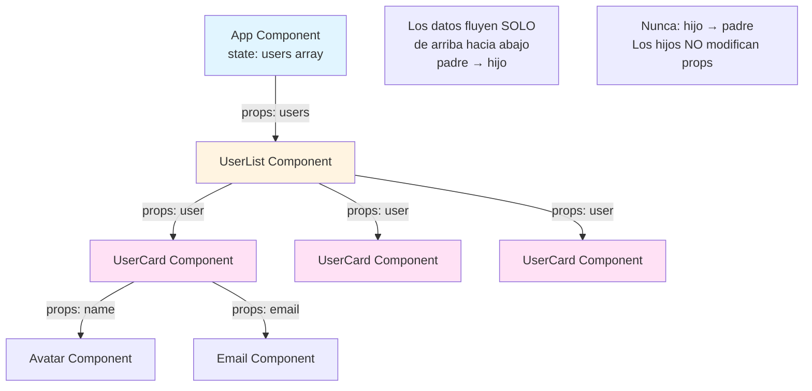
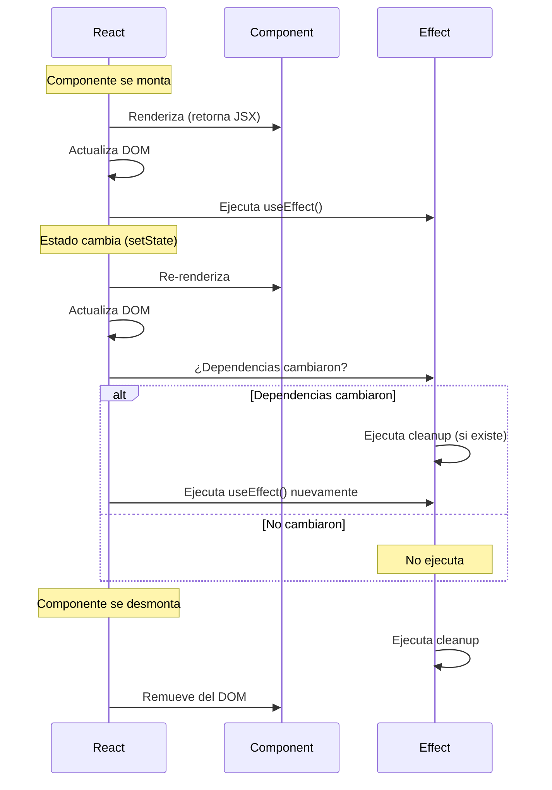
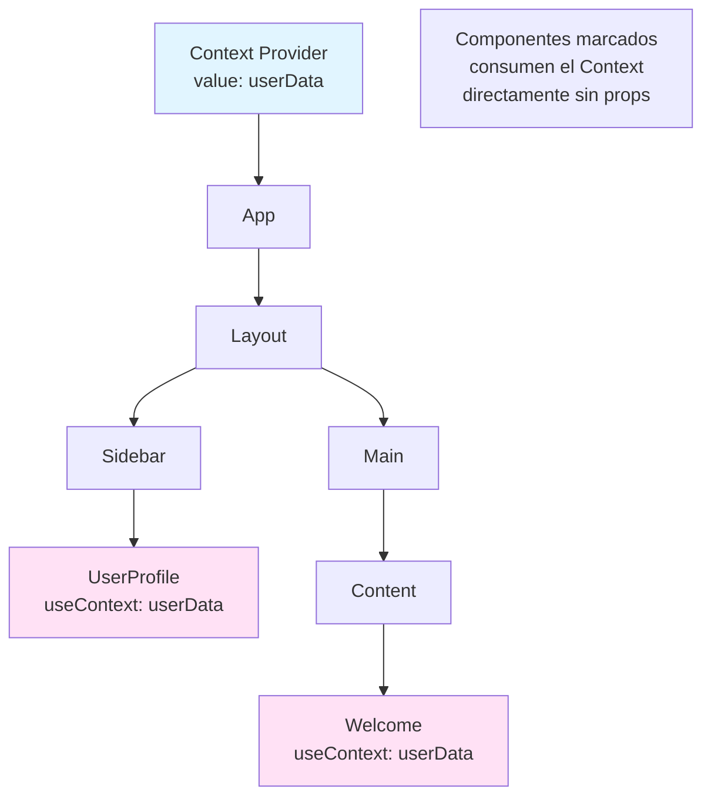
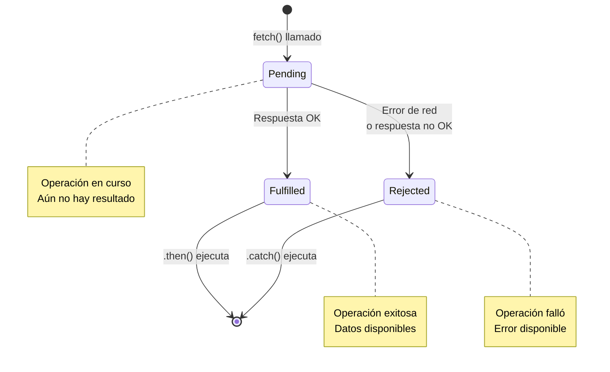

# React

## Introducción

### ¿Qué es React?

React es una librería JavaScript declarativa, eficiente y flexible para construir interfaces de usuario (UI). Creada por Facebook en 2013, permite construir UIs complejas a partir de piezas pequeñas y aisladas llamadas "componentes". React se enfoca únicamente en la capa de vista (la "V" en MVC), dejándote elegir otras librerías para routing, state management global, etc.

### Conceptos Clave

- **Declarativo**: Describes *cómo debería verse* la UI para cada estado, no *cómo cambiarla* paso a paso (imperativo)
- **Component-based**: La UI se divide en componentes independientes y reutilizables
- **Learn once, write anywhere**: Mismos conceptos para web (React), mobile (React Native), VR, etc.
- **Virtual DOM**: React mantiene una representación en memoria del DOM; calcula diferencias (diffing) y actualiza solo lo necesario
- **Unidirectional data flow**: Los datos fluyen de componentes padres a hijos mediante "props"

### ¿Por qué React?

**Problema con JavaScript Vanilla:**
```javascript
// Imperativo: describes cada paso
let contador = 0;
const display = document.getElementById('contador');
const btn = document.getElementById('btn');

btn.addEventListener('click', () => {
    contador++;  // 1. Actualizar dato
    display.textContent = contador;  // 2. Actualizar DOM manualmente
    if (contador > 10) {
        display.style.color = 'red';  // 3. Lógica de presentación mezclada
    }
});
```

**Solución con React:**
```javascript
// Declarativo: describes el resultado final
function Contador() {
    const [contador, setContador] = useState(0);
    
    return (
        <div>
            <p style={{ color: contador > 10 ? 'red' : 'black' }}>
                {contador}
            </p>
            <button onClick={() => setContador(contador + 1)}>
                Incrementar
            </button>
        </div>
    );
}
// React se encarga de actualizar el DOM eficientemente
```

---

## JSX

### Definición

JSX (JavaScript XML) es una extensión de sintaxis para JavaScript que permite escribir estructuras similares a HTML dentro de código JavaScript. Aunque parece HTML, es azúcar sintáctica que se transforma a llamadas a funciones JavaScript (`React.createElement()`). JSX hace el código más legible y permite aprovechar todo el poder de JavaScript en el markup.

### Conceptos Clave

- **No es HTML**: Es JavaScript; se compila a `React.createElement()` mediante Babel/Vite/Webpack
- **Expresiones JavaScript**: Cualquier expresión JS válida puede ir dentro de `{}`
- **CamelCase en atributos**: `className` en lugar de `class`, `onClick` en lugar de `onclick`
- **Cierre obligatorio**: Tags sin hijos deben auto-cerrarse: ``, `<br />`
- **Un solo elemento raíz**: JSX debe retornar un solo elemento padre (o usar Fragment `<>...</>`)

### Ejemplo: JSX vs JavaScript

```javascript
// JSX (lo que escribes)
const element = <h1 className="title">¡Hola, mundo!</h1>;

// Se compila a JavaScript (lo que ejecuta el navegador)
const element = React.createElement(
    'h1',
    { className: 'title' },
    '¡Hola, mundo!'
);
```

### Ejemplo: JSX completo

```javascript
import React from 'react';

function Bienvenida() {
    const nombre = "Ana";
    const edad = 21;
    const materias = ["Algoritmos", "Desarrollo Web", "Bases de Datos"];
    
    return (
        <div className="container">
            {/* Comentarios en JSX */}
            <h1>¡Hola, {nombre}!</h1>
            
            {/* Expresiones JavaScript entre llaves */}
            <p>Tienes {edad} años</p>
            <p>Año de nacimiento: {2026 - edad}</p>
            
            {/* Condicionales: operador ternario */}
            <p>Eres {edad >= 18 ? 'mayor' : 'menor'} de edad</p>
            
            {/* Condicional: && (renderiza si true) */}
            {edad >= 18 && <p>Puedes votar</p>}
            
            {/* Iterar sobre arrays con map() */}
            <ul>
                {materias.map((materia, index) => (
                    <li key={index}>{materia}</li>
                ))}
            </ul>
            
            {/* Estilos inline (objeto JavaScript) */}
            <p style={{ color: 'blue', fontSize: '18px', fontWeight: 'bold' }}>
                Texto con estilos
            </p>
            
            {/* Atributos dinámicos */}
            = 18 ? 'adulto' : 'menor'}
            />
            
            {/* Evento onClick con arrow function */}
            <button onClick={() => alert(`Hola, ${nombre}`)}>
                Saludar
            </button>
        </div>
    );
}

export default Bienvenida;
```

### Diferencias JSX vs HTML

```javascript
// HTML                        // JSX

class="container"              className="container"
for="name"                     htmlFor="name"
onclick="handler()"            onClick={handler}
style="color: blue;"           style={{ color: 'blue' }}
<br>                           <br />
<input>                        <input />
<!-- comentario -->            {/* comentario */}
tabindex="1"                   tabIndex={1}

// HTML permite tags abiertos  // JSX requiere cierre
                
<input type="text">            <input type="text" />
```

### Reglas importantes de JSX

1. **Un solo elemento raíz**: Retornar múltiples elementos requiere un padre
```javascript
// ❌ Error: múltiples raíces
return (
    <h1>Título</h1>
    <p>Párrafo</p>
);

// ✅ Correcto: div padre
return (
    <div>
        <h1>Título</h1>
        <p>Párrafo</p>
    </div>
);

// ✅ Correcto: Fragment (no agrega div extra al DOM)
return (
    <>
        <h1>Título</h1>
        <p>Párrafo</p>
    </>
);
```

2. **Key en listas**: Elementos en arrays necesitan prop `key` única
```javascript
// ❌ Sin key (React mostrará warning)
{usuarios.map(user => <li>{user.nombre}</li>)}

// ✅ Con key única
{usuarios.map(user => <li key={user.id}>{user.nombre}</li>)}
```

3. **Expresiones, no statements**: Solo expresiones dentro de `{}`
```javascript
// ❌ Error: if statement
{if (condicion) { <p>Texto</p> }}

// ✅ Operador ternario (expresión)
{condicion ? <p>Texto</p> : null}

// ✅ Operador && (expresión)
{condicion && <p>Texto</p>}
```

---

## Componentes

### Definición

Un componente React es una función JavaScript que retorna JSX, representando una parte de la UI. Los componentes permiten dividir la interfaz en piezas independientes y reutilizables, cada una con su propia lógica. Piensa en componentes como funciones que aceptan entradas ("props") y retornan elementos React describiendo lo que debe aparecer en pantalla.

### Conceptos Clave

- **Componentes funcionales**: Funciones simples que retornan JSX (enfoque moderno con Hooks)
- **Reutilización**: Un componente puede usarse múltiples veces con diferentes props
- **Composición**: Componentes pueden contener otros componentes (árbol de componentes)
- **Nombre con mayúscula**: Los componentes deben comenzar con mayúscula (`Button`, no `button`)

### Ejemplo: Componente básico

```javascript
// Componente simple sin props
function Saludo() {
    return <h1>¡Hola, estudiantes de UTN!</h1>;
}

// Uso del componente
function App() {
    return (
        <div>
            <Saludo />
            <Saludo />  {/* Puede reutilizarse */}
        </div>
    );
}
```

### Props (Propiedades)

#### Definición
Props (abreviatura de "propiedades") son argumentos que se pasan a un componente, similar a parámetros de funciones. Permiten personalizar componentes y hacerlos dinámicos. Las props son **read-only** (solo lectura): un componente nunca debe modificar sus propias props.

#### Conceptos Clave
- **Flujo unidireccional**: Props fluyen de padre a hijo, nunca al revés
- **Inmutables**: No se pueden modificar dentro del componente que las recibe
- **Cualquier tipo**: Pueden ser strings, números, objetos, arrays, funciones, otros componentes
- **Desestructuración**: Conveniente extraer props específicas del objeto props

#### Ejemplo: Componente con props

```javascript
// Componente que recibe props
function TarjetaEstudiante({ nombre, carrera, edad, aprobado }) {
    return (
        <div className="tarjeta">
            <h2>{nombre}</h2>
            <p>Carrera: {carrera}</p>
            <p>Edad: {edad}</p>
            <span className={aprobado ? 'aprobado' : 'desaprobado'}>
                {aprobado ? '✓ Aprobado' : '✗ Desaprobado'}
            </span>
        </div>
    );
}

// Uso del componente con diferentes props
function ListaEstudiantes() {
    return (
        <div>
            <TarjetaEstudiante 
                nombre="Ana García" 
                carrera="Sistemas" 
                edad={21}
                aprobado={true}
            />
            <TarjetaEstudiante 
                nombre="Carlos López" 
                carrera="Electrónica" 
                edad={20}
                aprobado={false}
            />
            <TarjetaEstudiante 
                nombre="María Rodríguez" 
                carrera="Sistemas" 
                edad={22}
                aprobado={true}
            />
        </div>
    );
}
```

#### Ejemplo: Props alternativas (sin desestructuración)

```javascript
// Sin desestructuración: recibe objeto props completo
function TarjetaEstudiante(props) {
    return (
        <div className="tarjeta">
            <h2>{props.nombre}</h2>
            <p>Carrera: {props.carrera}</p>
            <p>Edad: {props.edad}</p>
        </div>
    );
}
```

#### Ejemplo: Props con valores por defecto

```javascript
function Boton({ texto = "Click aquí", color = "blue", onClick }) {
    return (
        <button 
            style={{ backgroundColor: color, color: 'white', padding: '10px 20px' }}
            onClick={onClick}
        >
            {texto}
        </button>
    );
}

// Uso
<Boton texto="Enviar" color="green" onClick={() => alert('Enviado')} />
<Boton onClick={() => alert('Click')} />  {/* Usa valores por defecto */}
```

#### Ejemplo: Props children (contenido entre tags)

```javascript
// Componente que envuelve contenido
function Card({ titulo, children }) {
    return (
        <div className="card">
            <h3>{titulo}</h3>
            <div className="card-body">
                {children}  {/* Contenido pasado entre <Card>...</Card> */}
            </div>
        </div>
    );
}

// Uso
function App() {
    return (
        <Card titulo="Mi Tarjeta">
            <p>Este es el contenido de la tarjeta.</p>
            <button>Acción</button>
        </Card>
    );
}
```

### Diagrama: Flujo unidireccional de datos (Props)



### Reglas de los Componentes

#### 1. Nombre con mayúscula inicial
```javascript
// ❌ Error: minúscula (React lo trata como HTML tag)
function button() {
    return <button>Click</button>;
}

// ✅ Correcto: Mayúscula
function Button() {
    return <button>Click</button>;
}
```

#### 2. Retornar un solo elemento raíz
```javascript
// ❌ Error: múltiples raíces
function Componente() {
    return (
        <h1>Título</h1>
        <p>Texto</p>
    );
}

// ✅ Correcto: un padre
function Componente() {
    return (
        <div>
            <h1>Título</h1>
            <p>Texto</p>
        </div>
    );
}
```

#### 3. Props son read-only (inmutables)
```javascript
// ❌ Error: modificar props
function Componente({ nombre }) {
    nombre = "Otro nombre";  // ¡NUNCA hacer esto!
    return <h1>{nombre}</h1>;
}

// ✅ Correcto: usar estado local si necesitas modificar
function Componente({ nombreInicial }) {
    const [nombre, setNombre] = useState(nombreInicial);
    return (
        <div>
            <h1>{nombre}</h1>
            <button onClick={() => setNombre("Nuevo nombre")}>
                Cambiar
            </button>
        </div>
    );
}
```

#### 4. Componentes puros (funciones puras cuando sea posible)
```javascript
// ✅ Componente puro: mismo input → mismo output
function Saludo({ nombre }) {
    return <h1>Hola, {nombre}</h1>;
}

// ❌ No puro: depende de variable externa mutable
let contador = 0;
function ContadorImpuro() {
    contador++;  // Efecto secundario
    return <p>{contador}</p>;
}

// ✅ Usar state para valores que cambian
function ContadorPuro() {
    const [contador, setContador] = useState(0);
    return <p>{contador}</p>;
}
```

---

## Hooks

### Definición

Los Hooks son funciones especiales que permiten "enganchar" (hook into) características de React en componentes funcionales: estado, efectos secundarios, contexto, etc. Introducidos en React 16.8 (2019), reemplazan la necesidad de componentes de clase. Los hooks comienzan con `use` (convención) y solo pueden llamarse en el nivel superior de componentes funcionales.

### Conceptos Clave

- **Solo en componentes funcionales**: No usar en clases, funciones regulares o loops/condiciones
- **Nivel superior**: Llamar hooks al inicio del componente, no dentro de if/loops/funciones anidadas
- **Convención de nombres**: Hooks built-in comienzan con `use` (`useState`, `useEffect`); custom hooks también
- **Reemplazan clases**: Todo lo que hacían class components ahora puede hacerse con funciones + hooks

### useState

#### Definición
`useState` es el hook que permite agregar estado local a un componente funcional. Estado (state) es información que puede cambiar durante el ciclo de vida del componente. Cuando el estado cambia mediante el setter, React re-renderiza el componente con el nuevo valor.

#### Conceptos Clave
- **Sintaxis**: `const [valor, setValor] = useState(valorInicial);`
- **Array destructuring**: useState retorna array `[estadoActual, funcionParaActualizarlo]`
- **Inmutabilidad**: No modificar el estado directamente; siempre usar el setter
- **Re-render**: Llamar al setter hace que React re-renderice el componente

#### Ejemplo: useState básico

```javascript
import { useState } from 'react';

function Contador() {
    // Declarar estado: contador es el valor, setContador es la función para cambiarlo
    const [contador, setContador] = useState(0);  // 0 es el valor inicial
    
    return (
        <div>
            <p>Contador: {contador}</p>
            
            {/* Incrementar */}
            <button onClick={() => setContador(contador + 1)}>
                +1
            </button>
            
            {/* Decrementar */}
            <button onClick={() => setContador(contador - 1)}>
                -1
            </button>
            
            {/* Resetear */}
            <button onClick={() => setContador(0)}>
                Reset
            </button>
        </div>
    );
}
```

#### Ejemplo: Múltiples estados

```javascript
function Formulario() {
    const [nombre, setNombre] = useState("");
    const [email, setEmail] = useState("");
    const [edad, setEdad] = useState(18);
    const [aceptaTerminos, setAceptaTerminos] = useState(false);
    
    const handleSubmit = (e) => {
        e.preventDefault();
        console.log({ nombre, email, edad, aceptaTerminos });
    };
    
    return (
        <form onSubmit={handleSubmit}>
            <input 
                type="text" 
                value={nombre}
                onChange={(e) => setNombre(e.target.value)}
                placeholder="Nombre"
            />
            
            <input 
                type="email" 
                value={email}
                onChange={(e) => setEmail(e.target.value)}
                placeholder="Email"
            />
            
            <input 
                type="number" 
                value={edad}
                onChange={(e) => setEdad(Number(e.target.value))}
            />
            
            <label>
                <input 
                    type="checkbox"
                    checked={aceptaTerminos}
                    onChange={(e) => setAceptaTerminos(e.target.checked)}
                />
                Acepto términos y condiciones
            </label>
            
            <button type="submit" disabled={!aceptaTerminos}>
                Enviar
            </button>
        </form>
    );
}
```

#### Ejemplo: Estado con objetos

```javascript
function PerfilEditor() {
    const [perfil, setPerfil] = useState({
        nombre: "Ana",
        edad: 21,
        carrera: "Sistemas"
    });
    
    // Actualizar propiedad individual (mantener las demás)
    const actualizarNombre = (nuevoNombre) => {
        setPerfil({
            ...perfil,           // Spread: copia propiedades existentes
            nombre: nuevoNombre  // Sobrescribe solo nombre
        });
    };
    
    return (
        <div>
            <p>Nombre: {perfil.nombre}</p>
            <p>Edad: {perfil.edad}</p>
            <p>Carrera: {perfil.carrera}</p>
            
            <input 
                value={perfil.nombre}
                onChange={(e) => actualizarNombre(e.target.value)}
            />
        </div>
    );
}
```

#### Ejemplo: Estado con arrays

```javascript
function ListaTareas() {
    const [tareas, setTareas] = useState([
        { id: 1, texto: "Estudiar React", completada: false },
        { id: 2, texto: "Hacer TP", completada: false }
    ]);
    const [nuevaTarea, setNuevaTarea] = useState("");
    
    // Agregar tarea
    const agregarTarea = () => {
        if (nuevaTarea.trim() === "") return;
        
        setTareas([
            ...tareas,  // Copiar tareas existentes
            { 
                id: Date.now(), 
                texto: nuevaTarea, 
                completada: false 
            }
        ]);
        setNuevaTarea("");
    };
    
    // Marcar como completada
    const toggleTarea = (id) => {
        setTareas(tareas.map(tarea => 
            tarea.id === id 
                ? { ...tarea, completada: !tarea.completada }
                : tarea
        ));
    };
    
    // Eliminar tarea
    const eliminarTarea = (id) => {
        setTareas(tareas.filter(tarea => tarea.id !== id));
    };
    
    return (
        <div>
            <input 
                value={nuevaTarea}
                onChange={(e) => setNuevaTarea(e.target.value)}
                placeholder="Nueva tarea"
            />
            <button onClick={agregarTarea}>Agregar</button>
            
            <ul>
                {tareas.map(tarea => (
                    <li key={tarea.id}>
                        <input 
                            type="checkbox"
                            checked={tarea.completada}
                            onChange={() => toggleTarea(tarea.id)}
                        />
                        <span style={{ 
                            textDecoration: tarea.completada ? 'line-through' : 'none' 
                        }}>
                            {tarea.texto}
                        </span>
                        <button onClick={() => eliminarTarea(tarea.id)}>
                            Eliminar
                        </button>
                    </li>
                ))}
            </ul>
        </div>
    );
}
```

### useEffect

#### Definición
`useEffect` permite ejecutar efectos secundarios (side effects) en componentes funcionales: llamadas a APIs, suscripciones, manipulación directa del DOM, timers, logging, etc. Se ejecuta después de que el componente se renderiza. Reemplaza los métodos de ciclo de vida de componentes de clase (`componentDidMount`, `componentDidUpdate`, `componentWillUnmount`).

#### Conceptos Clave
- **Sintaxis**: `useEffect(() => { /* efecto */ }, [dependencias]);`
- **Timing**: Se ejecuta después del render (no bloquea la UI)
- **Array de dependencias**: Controla cuándo re-ejecutar el efecto
- **Cleanup**: Retornar función para limpiar recursos (unsubscribe, clear timers)

#### Ejemplo: useEffect básico (mount)

```javascript
import { useState, useEffect } from 'react';

function Contador() {
    const [contador, setContador] = useState(0);
    
    // Se ejecuta después del primer render (componentDidMount)
    // y después de cada re-render (componentDidUpdate)
    useEffect(() => {
        console.log(`El contador cambió a: ${contador}`);
        document.title = `Contador: ${contador}`;
    });
    
    return (
        <div>
            <p>Contador: {contador}</p>
            <button onClick={() => setContador(contador + 1)}>
                Incrementar
            </button>
        </div>
    );
}
```

#### Array de dependencias

```javascript
function Ejemplo() {
    const [contador, setContador] = useState(0);
    const [nombre, setNombre] = useState("Ana");
    
    // 1️⃣ Sin dependencias: se ejecuta después de CADA render
    useEffect(() => {
        console.log("Cada render");
    });
    
    // 2️⃣ Array vacío []: se ejecuta SOLO una vez (al montar)
    useEffect(() => {
        console.log("Solo al montar componente");
        // Equivalente a componentDidMount
    }, []);
    
    // 3️⃣ Con dependencias: se ejecuta cuando cambian las dependencias
    useEffect(() => {
        console.log(`Contador cambió: ${contador}`);
        // Solo se ejecuta cuando 'contador' cambia
    }, [contador]);
    
    // 4️⃣ Múltiples dependencias
    useEffect(() => {
        console.log(`Contador: ${contador}, Nombre: ${nombre}`);
        // Se ejecuta cuando contador O nombre cambian
    }, [contador, nombre]);
    
    return <div>...</div>;
}
```

**💡 Ver ejemplo:** [React Básico GET](ejemplos-hypertexto/11-react-basico-get/)

#### Ejemplo: Fetch de datos (API)

```javascript
function ListaUsuarios() {
    const [usuarios, setUsuarios] = useState([]);
    const [cargando, setCargando] = useState(true);
    const [error, setError] = useState(null);
    
    useEffect(() => {
        // Fetch al montar el componente
        fetch('https://jsonplaceholder.typicode.com/users')
            .then(response => {
                if (!response.ok) {
                    throw new Error('Error en la petición');
                }
                return response.json();
            })
            .then(data => {
                setUsuarios(data);
                setCargando(false);
            })
            .catch(err => {
                setError(err.message);
                setCargando(false);
            });
    }, []);  // Array vacío: solo ejecutar una vez
    
    if (cargando) return <p>Cargando usuarios...</p>;
    if (error) return <p>Error: {error}</p>;
    
    return (
        <ul>
            {usuarios.map(usuario => (
                <li key={usuario.id}>{usuario.name}</li>
            ))}
        </ul>
    );
}
```

#### Ejemplo: Cleanup (limpiar recursos)

```javascript
function Temporizador() {
    const [segundos, setSegundos] = useState(0);
    
    useEffect(() => {
        // Iniciar timer
        const intervalId = setInterval(() => {
            setSegundos(s => s + 1);
        }, 1000);
        
        // Cleanup: limpiar timer al desmontar
        return () => {
            clearInterval(intervalId);
            console.log("Timer limpiado");
        };
    }, []);  // Solo al montar/desmontar
    
    return <p>Segundos: {segundos}</p>;
}
```

#### Diagrama: Ciclo de vida de useEffect



### Reglas de los Hooks

#### 1. Solo llamar hooks en el nivel superior
```javascript
// ❌ Error: hook dentro de condición
function Componente({ mostrar }) {
    if (mostrar) {
        const [contador, setContador] = useState(0);  // ❌
    }
    return <div>{contador}</div>;
}

// ✅ Correcto: hook en nivel superior
function Componente({ mostrar }) {
    const [contador, setContador] = useState(0);  // ✅
    
    if (!mostrar) return null;
    return <div>{contador}</div>;
}
```

#### 2. Solo llamar hooks en componentes React
```javascript
// ❌ Error: hook en función regular
function utilidad() {
    const [valor, setValor] = useState(0);  // ❌
}

// ✅ Correcto: hook en componente React
function Componente() {
    const [valor, setValor] = useState(0);  // ✅
    return <div>{valor}</div>;
}

// ✅ Correcto: hook en custom hook
function useCustomHook() {
    const [valor, setValor] = useState(0);  // ✅
    return valor;
}
```

#### 3. Orden consistente
```javascript
// React depende del ORDEN de llamada de hooks
function Componente({ condicion }) {
    const [a, setA] = useState(0);     // 1er hook
    const [b, setB] = useState(0);     // 2do hook
    const [c, setC] = useState(0);     // 3er hook
    
    // El orden DEBE ser el mismo en cada render
    // React internamente usa el orden para trackear estados
}
```

### Otros Hooks

#### useMemo
Memoriza (cachea) el resultado de un cálculo costoso; solo recalcula cuando dependencias cambian.

```javascript
import { useMemo } from 'react';

function ComponenteCostoso({ numeros }) {
    // Filtrar y ordenar es costoso para arrays grandes
    const numerosProcesados = useMemo(() => {
        console.log("Calculando...");
        return numeros
            .filter(n => n > 10)
            .sort((a, b) => b - a);
    }, [numeros]);  // Solo recalcular si 'numeros' cambia
    
    return <ul>{numerosProcesados.map(n => <li key={n}>{n}</li>)}</ul>;
}
```

#### useCallback
Memoriza una función; útil para evitar re-creaciones innecesarias.

```javascript
import { useState, useCallback } from 'react';

function Padre() {
    const [contador, setContador] = useState(0);
    
    // Sin useCallback, esta función se re-crea en cada render
    // Con useCallback, la misma referencia se mantiene
    const incrementar = useCallback(() => {
        setContador(c => c + 1);
    }, []);  // Dependencias vacías: función nunca cambia
    
    return <Hijo onIncrement={incrementar} />;
}
```

#### useRef
Crea una referencia mutable que persiste entre renders sin causar re-renders. Útil para acceder al DOM o guardar valores mutables.

```javascript
import { useRef, useEffect } from 'react';

function InputEnfocado() {
    const inputRef = useRef(null);
    
    useEffect(() => {
        // Enfocar input al montar
        inputRef.current.focus();
    }, []);
    
    return <input ref={inputRef} type="text" />;
}
```

#### useContext
Accede a valores de un Context (veremos en la próxima sección).

```javascript
import { useContext } from 'react';

function Componente() {
    const usuario = useContext(UsuarioContext);
    return <p>Usuario: {usuario.nombre}</p>;
}
```

---

## Context

### Definición

Context proporciona una forma de pasar datos a través del árbol de componentes sin tener que pasar props manualmente en cada nivel (prop drilling). Es útil para datos "globales" como usuario autenticado, tema (dark/light), idioma, configuración, etc. Context no es state management completo (para eso considera Redux/Zustand), pero soluciona el problema de props intermedias innecesarias.

### Conceptos Clave

- **Provider**: Componente que provee el valor del contexto a sus hijos
- **Consumer (useContext)**: Hook para acceder al valor del contexto
- **Valor global**: Cualquier componente descendiente puede acceder sin pasar props
- **Re-render**: Componentes que consumen el contexto se re-renderizan cuando el valor cambia

### Problema: Prop Drilling

```javascript
// Sin Context: pasar props por múltiples niveles
function App() {
    const [usuario, setUsuario] = useState({ nombre: "Ana", rol: "admin" });
    
    return <Layout usuario={usuario} />;
}

function Layout({ usuario }) {
    return <Header usuario={usuario} />;  // Solo pasa la prop
}

function Header({ usuario }) {
    return <UserMenu usuario={usuario} />;  // Solo pasa la prop
}

function UserMenu({ usuario }) {
    return <p>Hola, {usuario.nombre}</p>;  // Finalmente usa la prop
}
```

### Solución: Context

```javascript
import { createContext, useContext, useState } from 'react';

// 1. Crear el Context
const UsuarioContext = createContext(null);

// 2. Componente Provider que envuelve la app
function App() {
    const [usuario, setUsuario] = useState({ nombre: "Ana", rol: "admin" });
    
    return (
        <UsuarioContext.Provider value={usuario}>
            <Layout />  {/* No pasa props */}
        </UsuarioContext.Provider>
    );
}

// 3. Componentes intermedios no necesitan pasar props
function Layout() {
    return <Header />;
}

function Header() {
    return <UserMenu />;
}

// 4. Componente que consume el Context
function UserMenu() {
    const usuario = useContext(UsuarioContext);  // Acceso directo
    return <p>Hola, {usuario.nombre}</p>;
}
```

### Ejemplo completo: Tema (Dark/Light mode)

```javascript
import { createContext, useContext, useState } from 'react';

// Crear Context
const TemaContext = createContext(null);

// Provider component
function TemaProvider({ children }) {
    const [tema, setTema] = useState('light');
    
    const toggleTema = () => {
        setTema(tema === 'light' ? 'dark' : 'light');
    };
    
    const value = { tema, toggleTema };
    
    return (
        <TemaContext.Provider value={value}>
            {children}
        </TemaContext.Provider>
    );
}

// Custom hook para usar el contexto
function useTema() {
    const context = useContext(TemaContext);
    if (!context) {
        throw new Error('useTema debe usarse dentro de TemaProvider');
    }
    return context;
}

// Componente que usa el tema
function Boton() {
    const { tema, toggleTema } = useTema();
    
    const estilos = {
        backgroundColor: tema === 'light' ? '#fff' : '#333',
        color: tema === 'light' ? '#000' : '#fff',
        padding: '10px 20px',
        border: '1px solid #ccc'
    };
    
    return (
        <button style={estilos} onClick={toggleTema}>
            Cambiar a {tema === 'light' ? 'oscuro' : 'claro'}
        </button>
    );
}

// App principal
function App() {
    return (
        <TemaProvider>
            <div>
                <h1>Mi Aplicación</h1>
                <Boton />
            </div>
        </TemaProvider>
    );
}
```

### Diagrama: Arquitectura Context



---

## useReducer

### Definición

`useReducer` es un hook para manejar estado complejo con lógica de actualización centralizada. Similar a `useState` pero más adecuado cuando el estado tiene múltiples valores relacionados o cuando la lógica de actualización es compleja. Inspirado en el patrón Redux: dispatch(action) → reducer(state, action) → nuevo estado.

### Conceptos Clave

- **Reducer**: Función pura `(state, action) => newState` que especifica cómo actualizar el estado
- **Action**: Objeto que describe qué cambiar (convencionalmente tiene `type` y opcionalmente `payload`)
- **Dispatch**: Función que envía una action al reducer
- **Estado centralizado**: Toda la lógica de actualización en un solo lugar (reducer)

### Sintaxis

```javascript
const [state, dispatch] = useReducer(reducer, initialState);

// reducer: función (state, action) => newState
// initialState: valor inicial del estado
// state: estado actual
// dispatch: función para enviar actions
```

### Ejemplo: Contador con useReducer

```javascript
import { useReducer } from 'react';

// Reducer: función pura que maneja actualizaciones
function contadorReducer(state, action) {
    switch (action.type) {
        case 'INCREMENT':
            return { contador: state.contador + 1 };
        case 'DECREMENT':
            return { contador: state.contador - 1 };
        case 'RESET':
            return { contador: 0 };
        case 'SET':
            return { contador: action.payload };
        default:
            throw new Error(`Action type desconocido: ${action.type}`);
    }
}

function Contador() {
    // Estado inicial
    const initialState = { contador: 0 };
    
    // useReducer retorna [estado actual, función dispatch]
    const [state, dispatch] = useReducer(contadorReducer, initialState);
    
    return (
        <div>
            <p>Contador: {state.contador}</p>
            
            <button onClick={() => dispatch({ type: 'INCREMENT' })}>
                +1
            </button>
            
            <button onClick={() => dispatch({ type: 'DECREMENT' })}>
                -1
            </button>
            
            <button onClick={() => dispatch({ type: 'RESET' })}>
                Reset
            </button>
            
            <button onClick={() => dispatch({ type: 'SET', payload: 100 })}>
                Set 100
            </button>
        </div>
    );
}
```

### Ejemplo: Formulario complejo con useReducer

```javascript
function formularioReducer(state, action) {
    switch (action.type) {
        case 'SET_FIELD':
            return {
                ...state,
                [action.field]: action.value
            };
        case 'RESET':
            return {
                nombre: '',
                email: '',
                mensaje: ''
            };
        case 'SET_ERROR':
            return {
                ...state,
                error: action.payload
            };
        default:
            return state;
    }
}

function Formulario() {
    const initialState = {
        nombre: '',
        email: '',
        mensaje: '',
        error: null
    };
    
    const [state, dispatch] = useReducer(formularioReducer, initialState);
    
    const handleSubmit = (e) => {
        e.preventDefault();
        
        if (state.nombre.length < 3) {
            dispatch({ 
                type: 'SET_ERROR', 
                payload: 'Nombre debe tener al menos 3 caracteres' 
            });
            return;
        }
        
        console.log('Enviando:', state);
        dispatch({ type: 'RESET' });
    };
    
    return (
        <form onSubmit={handleSubmit}>
            {state.error && <p style={{ color: 'red' }}>{state.error}</p>}
            
            <input 
                type="text"
                value={state.nombre}
                onChange={(e) => dispatch({ 
                    type: 'SET_FIELD', 
                    field: 'nombre', 
                    value: e.target.value 
                })}
                placeholder="Nombre"
            />
            
            <input 
                type="email"
                value={state.email}
                onChange={(e) => dispatch({ 
                    type: 'SET_FIELD', 
                    field: 'email', 
                    value: e.target.value 
                })}
                placeholder="Email"
            />
            
            <textarea 
                value={state.mensaje}
                onChange={(e) => dispatch({ 
                    type: 'SET_FIELD', 
                    field: 'mensaje', 
                    value: e.target.value 
                })}
                placeholder="Mensaje"
            />
            
            <button type="submit">Enviar</button>
        </form>
    );
}
```

### Diagrama: Flujo action → reducer → state

```mermaid
flowchart LR
    A[Usuario clickea botón] --> B[dispatch action<br/>{type: 'INCREMENT'}]
    B --> C[Reducer function<br/>contadorReducer state, action]
    C --> D{switch action.type}
    D -->|INCREMENT| E[return {contador: state.contador + 1}]
    D -->|DECREMENT| F[return {contador: state.contador - 1}]
    D -->|RESET| G[return {contador: 0}]
    E --> H[Nuevo estado]
    F --> H
    G --> H
    H --> I[React re-renderiza<br/>componente con nuevo estado]
    
    style A fill:#e1f5ff
    style B fill:#fff4e1
    style C fill:#ffe1f5
    style H fill:#e1ffe1
```

### useState vs useReducer

```javascript
// useState: para estado simple
function ContadorSimple() {
    const [contador, setContador] = useState(0);
    
    return (
        <div>
            <p>{contador}</p>
            <button onClick={() => setContador(contador + 1)}>+</button>
        </div>
    );
}

// useReducer: para estado complejo o lógica de actualización compleja
function ContadorComplejo() {
    const [state, dispatch] = useReducer(reducer, initialState);
    
    return (
        <div>
            <p>{state.contador}</p>
            <button onClick={() => dispatch({ type: 'INCREMENT' })}>+</button>
        </div>
    );
}
```

**Cuándo usar cada uno:**
- **useState**: Estado simple (booleanos, strings, números simples)
- **useReducer**: Estado complejo (objetos con múltiples campos), lógica de actualización compleja, múltiples formas de actualizar el estado

---

## Manejo de Estado

### Definición

El manejo de estado (state management) se refiere a cómo organizar, actualizar y compartir el estado (datos que cambian) en una aplicación React. El estado puede ser local (un solo componente), compartido (entre pocos componentes relacionados) o global (toda la aplicación). Elegir la estrategia correcta afecta la mantenibilidad, rendimiento y complejidad del código.

### Tipos de Estado

#### 1. Estado Local (Component State)
```javascript
// Estado que solo usa un componente
function Contador() {
    const [contador, setContador] = useState(0);
    return <p>{contador}</p>;
}
```

#### 2. Estado Compartido (Lifted State)
```javascript
// Estado que comparten hermanos: "levantar" al padre común
function Padre() {
    const [contador, setContador] = useState(0);
    
    return (
        <>
            <HijoA contador={contador} />
            <HijoB contador={contador} onIncrement={() => setContador(contador + 1)} />
        </>
    );
}
```

#### 3. Estado Global (Context/Redux)
```javascript
// Estado accesible desde cualquier componente
<EstadoProvider>
    <App />
</EstadoProvider>
```

### Principios de Manejo de Estado

1. **Co-location**: Mantén el estado lo más cerca posible de donde se usa
```javascript
// ✅ Estado local si solo un componente lo usa
function Componente() {
    const [mostrar, setMostrar] = useState(false);
    return <div>{mostrar && <p>Contenido</p>}</div>;
}
```

2. **Single Source of Truth**: Un solo lugar donde vive cada dato
```javascript
// ❌ Duplicar estado
function Padre() {
    const [nombre, setNombre] = useState("Ana");
    return <Hijo nombre={nombre} />;
}

function Hijo({ nombre }) {
    const [nombreLocal, setNombreLocal] = useState(nombre);  // ❌ Duplicado
    // Ahora hay dos fuentes de verdad, pueden desincronizarse
}

// ✅ Usar directamente la prop
function Hijo({ nombre }) {
    return <p>{nombre}</p>;  // ✅ Single source of truth
}
```

3. **Estado derivado**: Calcular valores en lugar de almacenarlos
```javascript
function ListaProductos({ productos }) {
    // ❌ Estado redundante
    const [total, setTotal] = useState(0);
    useEffect(() => {
        setTotal(productos.reduce((sum, p) => sum + p.precio, 0));
    }, [productos]);
    
    // ✅ Calcular directamente (estado derivado)
    const total = productos.reduce((sum, p) => sum + p.precio, 0);
    
    return <p>Total: ${total}</p>;
}
```

### Ejemplo: Levantamiento de Estado (Lifting State Up)

```javascript
// Dos componentes hermanos necesitan compartir estado
function ConversorTemperatura() {
    const [celsius, setCelsius] = useState(0);
    
    // Estado en padre común, pasado a hijos
    return (
        <div>
            <InputCelsius 
                value={celsius} 
                onChange={setCelsius} 
            />
            <InputFahrenheit 
                value={celsius * 9/5 + 32} 
                onChange={(f) => setCelsius((f - 32) * 5/9)} 
            />
        </div>
    );
}

function InputCelsius({ value, onChange }) {
    return (
        <div>
            <label>Celsius:</label>
            <input 
                type="number" 
                value={value}
                onChange={(e) => onChange(Number(e.target.value))}
            />
        </div>
    );
}

function InputFahrenheit({ value, onChange }) {
    return (
        <div>
            <label>Fahrenheit:</label>
            <input 
                type="number" 
                value={value}
                onChange={(e) => onChange(Number(e.target.value))}
            />
        </div>
    );
}
```

---

## Estado Asíncrono: Llamadas a API

**💡 Ver ejemplos:** [React Básico GET](ejemplos-hypertexto/11-react-basico-get/) | [React CRUD TodoList](ejemplos-hypertexto/12-react-crud-todolist/)

### Definición

La mayoría de aplicaciones web necesitan comunicarse con un servidor (backend) para obtener o enviar datos. En React, estas operaciones asíncronas (fetch, axios) se hacen típicamente en `useEffect` y el resultado se guarda en el estado con `useState`. El patrón común incluye tres estados: cargando (loading), datos (data), error (error).

### Fetch API

#### Definición
`fetch()` es la API moderna del navegador para hacer peticiones HTTP. Retorna una Promise que resuelve a un objeto Response. Es asíncrona (no bloquea el render), trabaja con Promises y async/await.

### Promises

#### Definición
Una Promise es un objeto que representa el resultado eventual (éxito o fallo) de una operación asíncrona. Tiene tres estados: pending (pendiente), fulfilled (resuelta exitosamente), rejected (rechazada con error). Se usan con `.then()/.catch()` o `async/await`.

#### Conceptos Clave
- **Estados**: Pending → Fulfilled (con valor) o Rejected (con error)
- **Chainable**: `.then()` retorna nueva Promise, permitiendo encadenar
- **Error handling**: `.catch()` atrapa errores o `try/catch` con async/await

### Diagrama: Ciclo de vida de una Promise



### Ejemplo: Fetch con then/catch

```javascript
function ListaUsuarios() {
    const [usuarios, setUsuarios] = useState([]);
    const [cargando, setCargando] = useState(true);
    const [error, setError] = useState(null);
    
    useEffect(() => {
        fetch('https://jsonplaceholder.typicode.com/users')
            .then(response => {
                if (!response.ok) {
                    throw new Error(`HTTP error! status: ${response.status}`);
                }
                return response.json();  // Parsear JSON
            })
            .then(data => {
                setUsuarios(data);
                setCargando(false);
            })
            .catch(error => {
                setError(error.message);
                setCargando(false);
            });
    }, []);  // Array vacío: solo ejecutar al montar
    
    if (cargando) return <p>Cargando usuarios...</p>;
    if (error) return <p>Error: {error}</p>;
    
    return (
        <ul>
            {usuarios.map(usuario => (
                <li key={usuario.id}>
                    {usuario.name} - {usuario.email}
                </li>
            ))}
        </ul>
    );
}
```

### Ejemplo: Fetch con async/await (más legible)

```javascript
function ListaUsuarios() {
    const [usuarios, setUsuarios] = useState([]);
    const [cargando, setCargando] = useState(true);
    const [error, setError] = useState(null);
    
    useEffect(() => {
        // Función async dentro de useEffect
        const fetchUsuarios = async () => {
            try {
                const response = await fetch('https://jsonplaceholder.typicode.com/users');
                
                if (!response.ok) {
                    throw new Error(`HTTP error! status: ${response.status}`);
                }
                
                const data = await response.json();
                setUsuarios(data);
                
            } catch (error) {
                setError(error.message);
            } finally {
                setCargando(false);
            }
        };
        
        fetchUsuarios();
    }, []);
    
    if (cargando) return <p>Cargando usuarios...</p>;
    if (error) return <p>Error: {error}</p>;
    
    return (
        <ul>
            {usuarios.map(usuario => (
                <li key={usuario.id}>{usuario.name}</li>
            ))}
        </ul>
    );
}
```

### Ejemplo: POST request (crear recurso)

```javascript
function CrearUsuario() {
    const [nombre, setNombre] = useState('');
    const [email, setEmail] = useState('');
    const [enviando, setEnviando] = useState(false);
    const [resultado, setResultado] = useState(null);
    
    const handleSubmit = async (e) => {
        e.preventDefault();
        setEnviando(true);
        
        try {
            const response = await fetch('https://jsonplaceholder.typicode.com/users', {
                method: 'POST',
                headers: {
                    'Content-Type': 'application/json'
                },
                body: JSON.stringify({ nombre, email })
            });
            
            if (!response.ok) {
                throw new Error('Error al crear usuario');
            }
            
            const data = await response.json();
            setResultado(`Usuario creado con ID: ${data.id}`);
            setNombre('');
            setEmail('');
            
        } catch (error) {
            setResultado(`Error: ${error.message}`);
        } finally {
            setEnviando(false);
        }
    };
    
    return (
        <form onSubmit={handleSubmit}>
            <input 
                type="text"
                value={nombre}
                onChange={(e) => setNombre(e.target.value)}
                placeholder="Nombre"
                required
            />
            <input 
                type="email"
                value={email}
                onChange={(e) => setEmail(e.target.value)}
                placeholder="Email"
                required
            />
            <button type="submit" disabled={enviando}>
                {enviando ? 'Enviando...' : 'Crear Usuario'}
            </button>
            {resultado && <p>{resultado}</p>}
        </form>
    );
}
```

### Patrón: Custom Hook para fetch

```javascript
// Hook reutilizable para fetch
function useFetch(url) {
    const [data, setData] = useState(null);
    const [loading, setLoading] = useState(true);
    const [error, setError] = useState(null);
    
    useEffect(() => {
        const fetchData = async () => {
            try {
                const response = await fetch(url);
                if (!response.ok) throw new Error('Error en fetch');
                const json = await response.json();
                setData(json);
            } catch (err) {
                setError(err.message);
            } finally {
                setLoading(false);
            }
        };
        
        fetchData();
    }, [url]);
    
    return { data, loading, error };
}

// Uso del custom hook
function Usuarios() {
    const { data, loading, error } = useFetch('https://jsonplaceholder.typicode.com/users');
    
    if (loading) return <p>Cargando...</p>;
    if (error) return <p>Error: {error}</p>;
    
    return (
        <ul>
            {data.map(usuario => <li key={usuario.id}>{usuario.name}</li>)}
        </ul>
    );
}
```

---

## Client-side Routing

### Definición

Client-side routing permite navegar entre diferentes "páginas" en una SPA sin recargar el navegador. La librería más popular para routing en React es React Router. El router cambia la URL (mediante History API) y renderiza el componente correspondiente, manteniendo el estado de la aplicación y dando sensación de navegación instantánea.

### Conceptos Clave

- **SPA routing**: Navegación sin recargas; JavaScript maneja cambios de URL
- **React Router**: Librería estándar para routing en React
- **Route**: Define qué componente renderizar para una ruta (path)
- **Link**: Componente para navegar sin recargar (reemplaza `<a>`)
- **useParams**: Hook para acceder a parámetros de URL dinámicos
- **useNavigate**: Hook para navegación programática

### Ejemplo: React Router básico

```javascript
import { BrowserRouter, Routes, Route, Link } from 'react-router-dom';

function App() {
    return (
        <BrowserRouter>
            <nav>
                <Link to="/">Inicio</Link>
                <Link to="/productos">Productos</Link>
                <Link to="/contacto">Contacto</Link>
            </nav>
            
            <Routes>
                <Route path="/" element={<Inicio />} />
                <Route path="/productos" element={<Productos />} />
                <Route path="/productos/:id" element={<DetalleProducto />} />
                <Route path="/contacto" element={<Contacto />} />
                <Route path="*" element={<NoEncontrado />} />
            </Routes>
        </BrowserRouter>
    );
}

function Inicio() {
    return <h1>Página de Inicio</h1>;
}

function Productos() {
    const productos = [
        { id: 1, nombre: "Laptop" },
        { id: 2, nombre: "Mouse" },
        { id: 3, nombre: "Teclado" }
    ];
    
    return (
        <div>
            <h1>Productos</h1>
            <ul>
                {productos.map(producto => (
                    <li key={producto.id}>
                        <Link to={`/productos/${producto.id}`}>
                            {producto.nombre}
                        </Link>
                    </li>
                ))}
            </ul>
        </div>
    );
}

function DetalleProducto() {
    const { id } = useParams();  // Obtener parámetro de URL
    
    return <h1>Detalle del producto {id}</h1>;
}

function Contacto() {
    return <h1>Contacto</h1>;
}

function NoEncontrado() {
    return <h1>404 - Página no encontrada</h1>;
}
```

### Ejemplo: Navegación programática

```javascript
import { useNavigate } from 'react-router-dom';

function Login() {
    const navigate = useNavigate();
    
    const handleLogin = (e) => {
        e.preventDefault();
        // Simular login exitoso
        const loginExitoso = true;
        
        if (loginExitoso) {
            navigate('/dashboard');  // Redirigir programáticamente
        }
    };
    
    return (
        <form onSubmit={handleLogin}>
            <input type="text" placeholder="Usuario" />
            <input type="password" placeholder="Contraseña" />
            <button type="submit">Iniciar sesión</button>
        </form>
    );
}
```

---

## Resumen

React permite construir interfaces de usuario modernas y eficientes mediante:

1. **JSX**: Sintaxis que mezcla JavaScript y markup, compilada a funciones React
2. **Componentes**: Funciones que retornan JSX, reutilizables y componibles
3. **Props**: Datos que fluyen de padres a hijos (unidireccional, read-only)
4. **Hooks**:
   - `useState`: Estado local que causa re-renders
   - `useEffect`: Efectos secundarios (fetch, suscripciones, timers)
   - `useContext`: Acceder a Context (estado global)
   - `useReducer`: Estado complejo con lógica centralizada
5. **Context**: Evitar prop drilling, compartir estado global
6. **Manejo de estado asíncrono**: Fetch + Promises + useState para llamadas API
7. **Client-side routing**: Navegación SPA con React Router

**Flujo típico de una aplicación React:**
- Componentes describen UI declarativamente
- Props pasan datos hacia abajo
- State maneja datos que cambian
- Eventos del usuario actualizan state
- React re-renderiza eficientemente (Virtual DOM)
- useEffect maneja side effects (API calls)
- Context comparte estado global
- Router maneja navegación

Con estos conceptos, puedes construir aplicaciones web completas con frontend React comunicándose con backend APIs.
