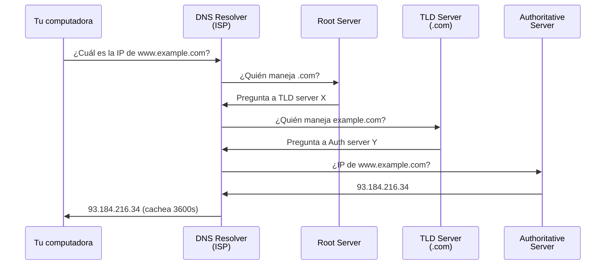
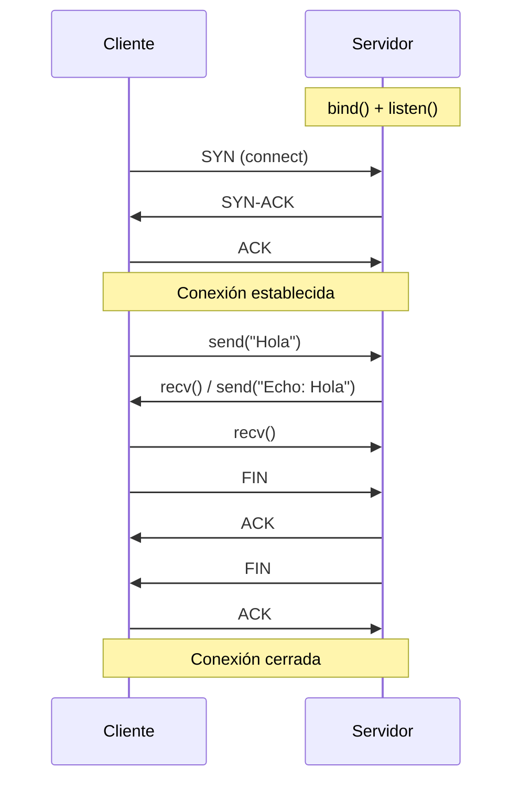
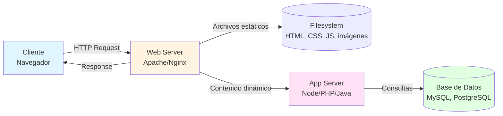
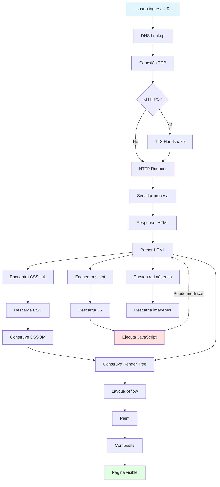
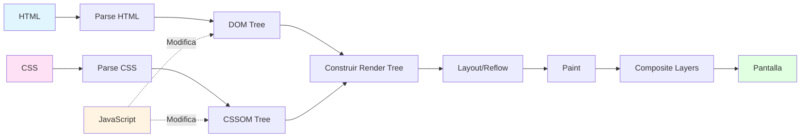


# ¿Qué es la WWW?

## Historia

### Definición
La World Wide Web (WWW) es un sistema de información distribuido basado en hipertexto, creado por Tim Berners-Lee en 1989 en el CERN. Permite acceder a documentos interconectados mediante enlaces, distribuidos en servidores alrededor del mundo y accesibles a través de Internet. A diferencia de Internet (la infraestructura de red), la Web es una aplicación que funciona sobre ella.

### Conceptos Clave
- **Internet vs Web**: Internet es la red física de computadoras; la Web es el sistema de documentos hipertextuales que funciona sobre Internet
- **Propuesta original (1989)**: Tim Berners-Lee propuso un sistema para compartir información entre científicos usando hipertexto distribuido
- **Primera página web (1991)**: Explicaba qué era la WWW y cómo crear páginas web, marcando el inicio de la era web
- **Evolución**: Web 1.0 (estática, solo lectura) → Web 2.0 (dinámica, interactiva, redes sociales) → Web 3.0 (descentralizada, semántica)

---

## Tecnologías

### Protocolos

#### TCP/IP

##### Definición
TCP/IP (Transmission Control Protocol/Internet Protocol) es el conjunto fundamental de protocolos que permite la comunicación en Internet. IP se encarga de enrutar paquetes entre computadoras usando direcciones IP, mientras que TCP garantiza que los datos lleguen completos y en orden. Es la base sobre la cual funcionan todos los protocolos de aplicación como HTTP.

##### Conceptos Clave
- **IP (Internet Protocol)**: Protocolo de red que asigna direcciones únicas (ej: `192.168.1.1` para IPv4 o `2001:0db8::1` para IPv6) y enruta paquetes
- **TCP (Transmission Control Protocol)**: Protocolo de transporte que establece conexiones confiables, maneja retransmisiones y orden de paquetes
- **Modelo de capas**: Aplicación → Transporte (TCP) → Red (IP) → Enlace de datos, cada capa tiene responsabilidades específicas
- **Puertos**: TCP usa puertos (0-65535) para identificar servicios; HTTP usa puerto 80, HTTPS puerto 443

##### Ejemplo
c```powershell
# Windows: Ver conexiones TCP activas
netstat -an | findstr ESTABLISHED

# Ejemplo de salida:
# TCP    192.168.1.5:52431     142.250.185.206:443    ESTABLISHED
#        ^tu IP local  ^puerto  ^servidor Google ^HTTPS
```

```bash
# Linux/Mac: Ver conexiones TCP activas
ss -tan | grep ESTABLISHED
# o alternativa más antigua
netstat -an | grep ESTABLISHED
```

#### URL / URI

##### Definición
Una URL (Uniform Resource Locator) es la dirección completa de un recurso en la Web, indicando su protocolo, ubicación y ruta. Es un tipo específico de URI (Uniform Resource Identifier), que identifica recursos de forma única. Las URLs permiten localizar y acceder a recursos web de manera estándar.

##### Conceptos Clave
- **Estructura**: `protocolo://dominio:puerto/ruta?parametros#fragmento`
- **Componentes obligatorios**: Protocolo (http, https) y dominio (ej: `www.example.com`)
- **Componentes opcionales**: Puerto (default 80 para HTTP, 443 para HTTPS), ruta, query string, fragmento
- **Encoding**: Caracteres especiales se codifican (espacio → `%20`, á → `%C3%A1`)

##### Ejemplo
```
https://www.example.com:443/productos/buscar?q=laptop&precio=max#resultados
│     │ │               │   │                │                 │
│     │ │               │   │                │                 └─ Fragmento (anchor)
│     │ │               │   │                └─ Query string (parámetros)
│     │ │               │   └─ Ruta
│     │ │               └─ Puerto (opcional, 443 es default para HTTPS)
│     │ └─ Dominio
│     └─ Subdominio
└─ Protocolo
```

#### DNS

##### Definición
DNS (Domain Name System) es el sistema distribuido que traduce nombres de dominio legibles por humanos (como `google.com`) en direcciones IP numéricas (como `142.250.185.206`) que las computadoras usan para comunicarse. Funciona como una "agenda telefónica" de Internet, almacenando registros en servidores DNS jerárquicos alrededor del mundo.

##### Conceptos Clave
- **Jerarquía**: Root servers → TLD servers (.com, .ar) → Authoritative servers (registros específicos del dominio)
- **Tipos de registros**: A (IPv4), AAAA (IPv6), CNAME (alias), MX (mail), TXT (texto arbitrario)
- **Caching**: Los resultados se cachean temporalmente (TTL) para evitar consultas repetidas y mejorar velocidad
- **Resolución recursiva**: Tu computadora consulta a un DNS resolver, que busca en la jerarquía hasta encontrar la IP

##### Diagrama: Proceso de Resolución DNS


##### Ejemplo

**Windows:**
```powershell
# Consultar DNS manualmente
nslookup google.com

# Salida:
# Server:  dns.google
# Address:  8.8.8.8
#
# Non-authoritative answer:
# Name:    google.com
# Addresses:  142.250.185.206
```

**Linux/Mac:**
```bash
# Consultar DNS manualmente (más herramientas disponibles)
dig google.com

# o el clásico
nslookup google.com

# o con host
host google.com
```

#### Sockets

##### Definición
Un socket es un extremo de comunicación entre dos procesos a través de una red. Es la interfaz de programación (API) que permite abrir conexiones, enviar y recibir bytes. En la Web, protocolos como HTTP se montan sobre sockets TCP: primero se establece la conexión de transporte y luego se intercambian mensajes de aplicación.

##### Conceptos Clave
- **Endpoint**: Combinación de IP + puerto (ej: `127.0.0.1:8080`)
- **TCP vs UDP**: TCP usa sockets tipo stream (confiables y ordenados); UDP usa datagramas (sin garantía de entrega)
- **Flujo cliente-servidor**: servidor hace `bind` + `listen` + `accept`; cliente hace `connect`
- **Operaciones básicas**: `send`/`recv` (o `write`/`read`) para intercambio de datos
- **Cierre de conexión**: liberar recursos con `close()` al finalizar

##### Diagrama: Conexión TCP con Sockets


##### Ejemplo: Cliente TCP en Python
```python
import socket

host = "example.com"
port = 80

with socket.socket(socket.AF_INET, socket.SOCK_STREAM) as sock:
    sock.connect((host, port))
    request = "GET / HTTP/1.1\r\nHost: example.com\r\nConnection: close\r\n\r\n"
    sock.sendall(request.encode("utf-8"))

    response = b""
    while True:
        chunk = sock.recv(4096)
        if not chunk:
            break
        response += chunk

print(response.decode("utf-8", errors="replace"))
```

##### Ejemplo: Cliente TCP en Node.js
```javascript
const net = require('net');

const client = net.createConnection({ host: 'example.com', port: 80 }, () => {
  const request =
    'GET / HTTP/1.1\r\n' +
    'Host: example.com\r\n' +
    'Connection: close\r\n\r\n';
  client.write(request);
});

client.on('data', (data) => {
  process.stdout.write(data.toString());
});

client.on('end', () => {
  console.log('\nConexión cerrada por el servidor.');
});

client.on('error', (err) => {
  console.error('Socket error:', err.message);
});
```

##### Ejemplo: Servidor TCP en Python
```python
import socket

# Crear socket servidor
server = socket.socket(socket.AF_INET, socket.SOCK_STREAM)

# Asociar socket a un puerto
server.bind(('127.0.0.1', 5000))

# Comenzar a escuchar conexiones entrantes
server.listen(1)
print("Servidor escuchando en puerto 5000...")

try:
    while True:
        # Aceptar una conexión entrante
        client_socket, client_address = server.accept()
        print(f"Conexión aceptada de {client_address}")
        
        try:
            # Recibir datos del cliente
            data = client_socket.recv(1024)
            if data:
                message = data.decode("utf-8")
                print(f"Recibido: {message}")
                
                # Enviar respuesta (echo)
                response = f"Echo: {message}"
                client_socket.sendall(response.encode("utf-8"))
        finally:
            client_socket.close()
except KeyboardInterrupt:
    print("\nServidor detenido.")
finally:
    server.close()
```

##### Ejemplo: Servidor TCP en Node.js
```javascript
const net = require('net');

// Crear servidor TCP
const server = net.createServer((socket) => {
  console.log(`Conexión aceptada de ${socket.remoteAddress}:${socket.remotePort}`);

  // Evento: datos recibidos del cliente
  socket.on('data', (data) => {
    const message = data.toString();
    console.log(`Recibido: ${message}`);
    
    // Enviar respuesta (echo) al cliente
    const response = `Echo: ${message}`;
    socket.write(response);
  });

  // Evento: cliente desconectado
  socket.on('end', () => {
    console.log('Cliente desconectado.');
  });

  // Evento: error en la conexión
  socket.on('error', (err) => {
    console.error('Socket error:', err.message);
  });
});

// Iniciar servidor en puerto 5000
server.listen(5000, '127.0.0.1', () => {
  console.log('Servidor escuchando en puerto 5000...');
});
```

#### HTTP

##### Definición
HTTP (HyperText Transfer Protocol) es el protocolo de aplicación que define cómo se transmiten mensajes entre clientes (navegadores) y servidores web. Es un protocolo sin estado (stateless), basado en texto, que funciona mediante un modelo de solicitud http-respuesta (request-response). HTTPS es la versión segura con cifrado TLS/SSL.

##### Conceptos Clave
- **Stateless**: Cada solicitud http es independiente; el servidor no recuerda solicitudes anteriores (se usan cookies/sesiones para mantener estado)
- **Cliente-Servidor**: El cliente (navegador) inicia solicitudes; el servidor responde con recursos (HTML, JSON, imágenes, etc.)
- **Versiones**: HTTP/1.1 (conexiones persistentes), HTTP/2 (multiplexing), HTTP/3 (sobre QUIC/UDP)
- **HTTPS = HTTP + TLS**: Cifra la comunicación para proteger datos sensibles (passwords, información personal)

##### Diagrama: Flujo HTTP Request/Response
```mermaid
sequenceDiagram
    participant Browser as Navegador
    participant Server as Servidor Web
    
    Browser->>Server: GET /index.html HTTP/1.1<br/>Host: example.com<br/>User-Agent: Mozilla/5.0
    Note over Server: Procesa la solicitud http<br/>Busca el archivo<br/>Genera respuesta
    Server->>Browser: HTTP/1.1 200 OK<br/>Content-Type: text/html<br/><br/>&lt;html&gt;...&lt;/html&gt;
    Note over Browser: Renderiza la página
```

###### Request

**Definición**
Un HTTP Request es el mensaje que el cliente envía al servidor para solicitar un recurso o acción. Contiene un método/verbo (GET, POST, etc.), la ruta del recurso (path), la versión del protocolo HTTP y headers con metadatos. Opcionalmente puede incluir un body con datos (común en POST/PUT).

**Conceptos Clave**
- **Línea de solicitud http**: `MÉTODO /ruta HTTP/1.1` (ej: `GET /api/users HTTP/1.1`)
- **Headers obligatorios**: `Host` indica el dominio destino (obligatorio en HTTP/1.1)
- **Headers comunes**: `User-Agent` (navegador), `Accept` (tipos de contenido aceptados), `Authorization` (credenciales)
- **Body**: Solo en algunos métodos (POST, PUT, PATCH); contiene datos a enviar (formularios, JSON, archivos)

**Ejemplo**
```http
POST /api/login HTTP/1.1
Host: api.example.com
Content-Type: application/json
Content-Length: 45
Authorization: Bearer eyJhbGc...

{"username": "student", "password": "pass123"}
```

###### Verbs (Métodos HTTP)

**Definición**
Los verbos HTTP (también llamados métodos) indican la acción que el cliente desea realizar sobre el recurso. Los más comunes son GET (leer), POST (crear), PUT (actualizar completo), PATCH (actualizar parcial) y DELETE (eliminar). Cada verbo tiene semántica específica y propiedades de seguridad/idempotencia definidas.

**Conceptos Clave**
- **GET**: Solicita un recurso; seguro (no modifica), idempotente, puede ser cacheado
- **POST**: Envía datos al servidor (crear recurso, procesar formulario); no idempotente
- **PUT**: Reemplaza completamente un recurso; idempotente
- **DELETE**: Elimina un recurso; idempotente
- **PATCH**: Actualiza parcialmente un recurso
- **HEAD**: Como GET pero solo retorna headers (sin body)
- **OPTIONS**: Consulta métodos permitidos en un recurso (usado en CORS)

**Ejemplo: Operaciones CRUD en una API**
```http
# CREATE - Crear nuevo usuario
POST /api/users
{"name": "Juan", "email": "juan@example.com"}

# READ - Obtener usuario con ID 123
GET /api/users/123

# UPDATE - Actualizar usuario completo
PUT /api/users/123
{"name": "Juan Pérez", "email": "juan.perez@example.com", "active": true}

# PARTIAL UPDATE - Actualizar solo el email
PATCH /api/users/123
{"email": "nuevo@example.com"}

# DELETE - Eliminar usuario
DELETE /api/users/123
```

**Comparación con Python/CRUD:**
```python
# En Python, CRUD podría verse así:
users = []

# CREATE (similar a POST)
def create_user(name, email):
    user = {"id": len(users), "name": name, "email": email}
    users.append(user)
    return user

# READ (similar a GET)
def get_user(user_id):
    return users[user_id]

# UPDATE (similar a PUT)
def update_user(user_id, name, email):
    users[user_id] = {"id": user_id, "name": name, "email": email}

# DELETE (similar a DELETE)
def delete_user(user_id):
    del users[user_id]
```

###### Headers y Body

**Definición**
Los headers HTTP son pares clave-valor que transmiten metadatos sobre la solicitud http o respuesta (tipo de contenido, autenticación, caching, etc.). El body es la sección opcional que contiene los datos reales enviados (en requests) o recibidos (en responses), separado de los headers por una línea en blanco.

**Conceptos Clave**
- **Headers de solicitud http**: `User-Agent`, `Accept`, `Cookie`, `Authorization`, `Content-Type`
- **Headers de respuesta**: `Content-Type`, `Content-Length`, `Set-Cookie`, `Cache-Control`, `Location`
- **Headers generales**: `Date`, `Connection`
- **Body encoding**: El header `Content-Type` especifica el formato del body (JSON, HTML, form data, imagen, etc.)

**Ejemplo: Headers y Body en Request**
```http
POST /api/products HTTP/1.1
Host: api.store.com
Content-Type: application/json          ← Indica que el body es JSON
Content-Length: 87                      ← Tamaño del body en bytes
Authorization: Bearer abc123token       ← Token de autenticación
Accept: application/json                ← Acepta respuestas en JSON
User-Agent: Mozilla/5.0                 ← Identifica el cliente

{"name": "Laptop", "price": 999.99, "stock": 15}  ← Body (datos)
```

**Ejemplo: Headers y Body en Response**
```http
HTTP/1.1 201 Created
Content-Type: application/json
Content-Length: 125
Location: /api/products/42
Set-Cookie: session=xyz789; HttpOnly
Cache-Control: no-cache

{"id": 42, "name": "Laptop", "price": 999.99, "stock": 15, "created": "2026-03-04T10:30:00Z"}
```

###### Response

**Definición**
Un HTTP Response es el mensaje que el servidor envía de vuelta al cliente tras procesar una solicitud http. Contiene una línea de estado (con código numérico y mensaje), headers con metadatos y opcionalmente un body con el contenido solicitado. El código de estado indica si la solicitud http fue exitosa o hubo algún error.

**Conceptos Clave**
- **Línea de estado**: `HTTP/1.1 200 OK` (versión del protocolo + código + frase descriptiva)
- **Estructura**: Status line + Headers + línea vacía + Body opcional
- **Headers importantes**: `Content-Type` (tipo de datos), `Content-Length` (tamaño), `Set-Cookie` (cookies), `Cache-Control` (políticas de caché)
- **Procesamiento**: El navegador interpreta el status code, headers y body para mostrar contenido o manejar errores

**Ejemplo: Response HTML**
```http
HTTP/1.1 200 OK
Date: Tue, 04 Mar 2026 14:30:00 GMT
Server: nginx/1.20.0
Content-Type: text/html; charset=UTF-8
Content-Length: 156
Cache-Control: max-age=3600

<!DOCTYPE html>
<html>
<head>
    <title>Mi Página</title>
</head>
<body>
    <h1>¡Hola, estudiantes de UTN!</h1>
</body>
</html>
```

**Ejemplo: Response JSON (API)**
```http
HTTP/1.1 200 OK
Content-Type: application/json
Content-Length: 88

{
  "status": "success",
  "data": {
    "users": [
      {"id": 1, "name": "Ana"},
      {"id": 2, "name": "Carlos"}
    ]
  }
}
```

###### Status Codes

**Definición**
Los códigos de estado HTTP son números de tres dígitos que el servidor envía en la respuesta para indicar el resultado de la solicitud http. Se agrupan en cinco categorías según su primer dígito: 1xx (informativo), 2xx (éxito), 3xx (redirección), 4xx (error del cliente) y 5xx (error del servidor).

**Conceptos Clave**
- **2xx Éxito**: La solicitud http fue recibida, entendida y procesada correctamente
- **4xx Error del cliente**: Error en la solicitud http (recurso no existe, falta autenticación, sintaxis incorrecta)
- **5xx Error del servidor**: El servidor falló al procesar una solicitud http válida
- **Idempotencia**: Algunos métodos + códigos permiten reintentar la operación de forma segura

**Códigos más comunes:**
```
2xx - Éxito
├─ 200 OK              → Solicitud HTTP exitosa (GET, POST procesado)
├─ 201 Created         → Recurso creado exitosamente (POST, PUT)
├─ 204 No Content      → Éxito pero sin body (DELETE exitoso)

3xx - Redirección
├─ 301 Moved Permanently  → Recurso movido permanentemente (actualizar bookmark)
├─ 302 Found              → Redirección temporal
├─ 304 Not Modified       → Recurso no cambió (usar caché)

4xx - Error del Cliente
├─ 400 Bad Request     → Sintaxis incorrecta (JSON malformado)
├─ 401 Unauthorized    → Requiere autenticación
├─ 403 Forbidden       → Autenticado pero sin permisos
├─ 404 Not Found       → Recurso no existe
├─ 422 Unprocessable   → Sintaxis OK pero validación falló

5xx - Error del Servidor
├─ 500 Internal Server Error  → Error genérico del servidor
├─ 502 Bad Gateway            → Gateway/proxy recibió respuesta inválida
├─ 503 Service Unavailable    → Servidor temporalmente fuera de servicio
```

**Ejemplo: Manejo de diferentes Status Codes**
```javascript
// Ejemplo ficticio en JavaScript (veremos esto más adelante)
fetch('/api/users/123')
  .then(response => {
    if (response.status === 200) {
      return response.json();  // Usuario encontrado
    } else if (response.status === 404) {
      console.error('Usuario no existe');
    } else if (response.status === 500) {
      console.error('Error del servidor');
    }
  });
```

**Comparación con códigos de retorno en C:**
```c
// En C, las funciones retornan códigos similares
int result = open_file("data.txt");

if (result == 0) {        // Similar a 200 OK
    // éxito
} else if (result == -1) { // Similar a 404 Not Found
    printf("Archivo no encontrado");
} else if (result == -2) { // Similar a 403 Forbidden
    printf("Sin permisos");
}
```

###### Web Servers

**Definición**
Un web server (servidor web) es un programa que escucha solicitudes HTTP en un puerto (típicamente 80 para HTTP, 443 para HTTPS) y responde con recursos (archivos HTML, imágenes, datos JSON, etc.). Puede servir archivos estáticos directamente o ejecutar código dinámico (scripts) para generar respuestas. Los servidores web más populares son Apache, Nginx, IIS y Node.js.

**Conceptos Clave**
- **Servidor HTTP vs Servidor de Aplicación**: HTTP server sirve archivos estáticos; app server ejecuta lógica de negocio (a menudo combinados)
- **Multithreading/Async**: Manejan múltiples solicitudes concurrentes (threads en Apache, event loop en Node.js/Nginx)
- **Hosting estático vs dinámico**: Estático sirve archivos sin modificación; dinámico genera contenido (consulta BD, procesa lógica)
- **Reverse Proxy**: Servidor intermediario que distribuye solicitudes entre múltiples servidores backend (load balancing)

**Diagrama: Arquitectura Cliente-Servidor**


####### Apache

**Definición**
Apache HTTP Server es uno de los servidores web más antiguos (1995) y populares del mundo. Es de código abierto, altamente configurable mediante módulos, y utiliza un modelo de procesos/threads para manejar solicitudes concurrentes. Tradicionalmente usado con PHP para crear sitios dinámicos (stack LAMP: Linux, Apache, MySQL, PHP).

**Conceptos Clave**
- **Modelo MPM (Multi-Processing Module)**: Prefork (un proceso por solicitud http), Worker (múltiples threads), Event (mejor para conexiones persistentes)
- **Módulos**: Extensible mediante módulos (mod_rewrite para URLs amigables, mod_ssl para HTTPS, mod_proxy para proxy)
- **.htaccess**: Archivos de configuración por directorio para rewrite rules, autenticación, etc.
- **Uso típico**: Hosting compartido tradicional, sitios PHP (WordPress, Drupal), aplicaciones legacy

**Ejemplo: Estructura básica de configuración Apache**
```apache
# Archivo httpd.conf o sitio en /etc/apache2/sites-available/
<VirtualHost *:80>
    ServerName www.example.com
    DocumentRoot /var/www/html
    
    <Directory /var/www/html>
        Options Indexes FollowSymLinks
        AllowOverride All
        Require all granted
    </Directory>
    
    ErrorLog ${APACHE_LOG_DIR}/error.log
    CustomLog ${APACHE_LOG_DIR}/access.log combined
</VirtualHost>
```

####### Nginx

**Definición**
Nginx (pronunciado "engine-x") es un servidor web moderno (2004) diseñado para alto rendimiento y baja utilización de recursos. Usa arquitectura event-driven asíncrona (event loop) en lugar de threads, lo que le permite manejar miles de conexiones concurrentes eficientemente. Comúnmente usado como reverse proxy, load balancer y para servir archivos estáticos.

**Conceptos Clave**
- **Event-driven**: Un solo proceso worker maneja múltiples conexiones usando I/O no bloqueante y event loop (similar a Node.js)
- **Rendimiento**: Supera a Apache en servir archivos estáticos y manejar muchas conexiones simultáneas con bajo consumo de memoria
- **Usos comunes**: Reverse proxy frente a app servers (Node.js, Python), load balancer, caché HTTP, servir assets estáticos
- **Configuración**: Archivos en `/etc/nginx/` con sintaxis declarativa (bloques server, location)

**Ejemplo: Configuración básica Nginx**
```nginx
# Archivo en /etc/nginx/sites-available/example
server {
    listen 80;
    server_name www.example.com;
    root /var/www/html;
    index index.html;
    
    # Servir archivos estáticos
    location /static/ {
        alias /var/www/static/;
        expires 30d;
    }
    
    # Proxy inverso a aplicación Node.js
    location /api/ {
        proxy_pass http://localhost:3000;
        proxy_set_header Host $host;
        proxy_set_header X-Real-IP $remote_addr;
    }
}
```

**Comparación Apache vs Nginx:**
```
Apache                          Nginx
├─ Threads/procesos             ├─ Event loop (async)
├─ Módulos dinámicos            ├─ Módulos compilados
├─ .htaccess (config por dir)   ├─ Config centralizada
├─ Mejor para PHP tradicional   ├─ Mejor para proxy/static
└─ Mayor consumo memoria        └─ Muy eficiente en recursos
```

####### PHP

**Definición**
PHP (Hypertext Preprocessor) es un lenguaje de scripting del lado del servidor, diseñado específicamente para desarrollo web. El servidor web (Apache con mod_php o PHP-FPM) ejecuta scripts PHP y genera HTML dinámico como respuesta. Es ampliamente usado para sitios dinámicos y CMS (WordPress, Drupal) y se integra fácilmente con bases de datos.

**Conceptos Clave**
- **Server-side**: PHP se ejecuta en el servidor, no en el navegador; el cliente solo recibe el HTML generado
- **Integración con servidores**: Apache (mod_php), Nginx (PHP-FPM), proceso FastCGI separado
- **Sintaxis**: Similar a C/Java; mezclado con HTML (`<?php ... ?>`)
- **Casos de uso**: Sitios dinámicos, APIs REST, CMSs, administración de contenido

**Ejemplo: Script PHP básico**
```php
<?php
// archivo: index.php
$nombre = "Estudiante UTN";
$hora = date("H:i");

echo "<!DOCTYPE html>";
echo "<html>";
echo "<head><title>Saludo</title></head>";
echo "<body>";
echo "<h1>¡Hola, $nombre!</h1>";
echo "<p>Son las $hora</p>";

// Consulta a base de datos (ejemplo conceptual)
$conn = new mysqli("localhost", "user", "pass", "database");
$result = $conn->query("SELECT * FROM usuarios");
while ($row = $result->fetch_assoc()) {
    echo "<p>Usuario: " . $row['nombre'] . "</p>";
}

echo "</body></html>";
?>
```

**Comparación con Python:**
```python
# Python tiene frameworks similares (Flask, Django)
# Flask ejemplo:
from flask import Flask
app = Flask(__name__)

@app.route('/')
def index():
    nombre = "Estudiante UTN"
    hora = datetime.now().strftime("%H:%M")
    return f"""
    <!DOCTYPE html>
    <html>
    <body>
        <h1>¡Hola, {nombre}!</h1>
        <p>Son las {hora}</p>
    </body>
    </html>
    """
```

####### Node.js

**Definición**
Node.js es un entorno de ejecución de JavaScript del lado del servidor, construido sobre el motor V8 de Chrome. Permite usar JavaScript tanto en frontend como en backend, usando un modelo event-driven no bloqueante ideal para aplicaciones I/O intensivas. Incluye npm (gestor de paquetes) con el ecosistema más grande de librerías open-source.

**Conceptos Clave**
- **JavaScript en el servidor**: Mismo lenguaje para frontend y backend, comparte código entre ambos
- **Event Loop**: Arquitectura asíncrona single-threaded con callbacks/promises para operaciones no bloqueantes (I/O, red, DB)
- **NPM (Node Package Manager)**: Millones de paquetes reutilizables (Express, React, etc.)
- **Casos de uso**: APIs REST, aplicaciones real-time (WebSockets), microservicios, herramientas de build (Webpack, Vite)

**Ejemplo: Servidor HTTP básico con Node.js**
```javascript
// archivo: server.js
const http = require('http');

const server = http.createServer((req, res) => {
  // req = request (solicitud http), res = response (respuesta)
  
  if (req.url === '/') {
    res.writeHead(200, {'Content-Type': 'text/html'});
    res.end('<h1>¡Hola desde Node.js!</h1>');
    
  } else if (req.url === '/api/users') {
    res.writeHead(200, {'Content-Type': 'application/json'});
    const users = [
      {id: 1, name: 'Ana'},
      {id: 2, name: 'Carlos'}
    ];
    res.end(JSON.stringify(users));
    
  } else {
    res.writeHead(404, {'Content-Type': 'text/plain'});
    res.end('404 Not Found');
  }
});

server.listen(3000, () => {
  console.log('Servidor corriendo en http://localhost:3000');
});
```

**Ejemplo: API REST con Express (framework)**
```javascript
// archivo: app.js
const express = require('express');
const app = express();

app.use(express.json()); // Middleware para parsear JSON

// GET - Listar usuarios
app.get('/api/users', (req, res) => {
  res.json([
    {id: 1, name: 'Ana'},
    {id: 2, name: 'Carlos'}
  ]);
});

// POST - Crear usuario
app.post('/api/users', (req, res) => {
  const newUser = req.body;
  // Aquí guardarías en base de datos
  res.status(201).json({id: 3, ...newUser});
});

app.listen(3000, () => {
  console.log('API corriendo en puerto 3000');
});
```

####### Java

**Definición**
Java es un lenguaje compilado orientado a objetos ampliamente usado para aplicaciones empresariales backend. Los servidores de aplicaciones Java (Tomcat, JBoss, WebLogic) ejecutan servlets y JSP (JavaServer Pages) para generar contenido dinámico. Spring Boot es el framework moderno más popular para crear APIs REST y microservicios en Java.

**Conceptos Clave**
- **Servlets**: Clases Java que manejan solicitudes HTTP (similar a controladores en otros frameworks)
- **Application Servers**: Tomcat (servlet container), JBoss/WildFly (full Java EE), Jetty (embeddable)
- **Spring Boot**: Framework moderno que simplifica configuración y permite crear aplicaciones standalone
- **Casos de uso**: Aplicaciones empresariales, backends bancarios/financieros, microservicios, sistemas críticos

**Ejemplo: Servlet Java básico**
```java
// archivo: HelloServlet.java
import javax.servlet.http.*;
import javax.servlet.annotation.*;
import java.io.IOException;

@WebServlet("/hello")
public class HelloServlet extends HttpServlet {
    
    @Override
    protected void doGet(HttpServletRequest req, HttpServletResponse resp) 
            throws IOException {
        resp.setContentType("text/html");
        resp.getWriter().println("<h1>¡Hola desde Java!</h1>");
    }
    
    @Override
    protected void doPost(HttpServletRequest req, HttpServletResponse resp) 
            throws IOException {
        String nombre = req.getParameter("nombre");
        resp.setContentType("application/json");
        resp.getWriter().println("{\"mensaje\": \"Hola, " + nombre + "\"}");
    }
}
```

**Ejemplo: API REST con Spring Boot**
```java
// archivo: UserController.java
import org.springframework.web.bind.annotation.*;
import java.util.*;

@RestController
@RequestMapping("/api/users")
public class UserController {
    
    @GetMapping
    public List<User> getUsers() {
        return Arrays.asList(
            new User(1, "Ana"),
            new User(2, "Carlos")
        );
    }
    
    @PostMapping
    public User createUser(@RequestBody User user) {
        user.setId(3);
        // Guardar en base de datos
        return user;
    }
    
    @GetMapping("/{id}")
    public User getUser(@PathVariable int id) {
        return new User(id, "Usuario " + id);
    }
}

class User {
    private int id;
    private String name;
    
    // Constructor, getters, setters...
}
```

---

### Navegador Web

#### Definición
Un navegador web (browser) es una aplicación cliente que interpreta y renderiza documentos web (HTML, CSS, JavaScript), permitiendo a los usuarios navegar por la WWW. Actúa como intermediario entre el usuario y los servidores web: realiza solicitudes HTTP, descarga recursos, ejecuta código JavaScript, renderiza contenido visual y maneja interacciones del usuario.

#### Conceptos Clave
- **Motores de renderizado**: Blink (Chrome/Edge), WebKit (Safari), Gecko (Firefox) - interpretan HTML/CSS y construyen el DOM
- **Motor JavaScript**: V8 (Chrome), SpiderMonkey (Firefox), JavaScriptCore (Safari) - ejecutan código JS
- **Componentes principales**: UI, motor de renderizado, motor JS, networking, almacenamiento (cookies, localStorage), APIs del navegador
- **Developer Tools**: Consola, inspector de elementos, debugger, network monitor - herramientas esenciales para desarrollo

#### Carga de la página (Networking)

##### Definición
La carga de una página web es un proceso multi-paso que comienza cuando el usuario ingresa una URL y termina cuando todos los recursos están descargados y renderizados. Involucra DNS lookup, conexión TCP, handshake TLS (si es HTTPS), solicitud, descarga del HTML y luego descarga secuencial/paralela de recursos referenciados (CSS, JS, imágenes).

##### Conceptos Clave
- **Critical Rendering Path**: Secuencia mínima de pasos para renderizar la primera vista (HTML → CSS → JS bloqueante)
- **Descarga de recursos**: HTML se parsea top-to-bottom; CSS/JS bloquean renderizado; imágenes se cargan en paralelo
- **Waterfall**: Las solicitudes tienen dependencias (HTML primero, luego sus recursos); DevTools muestra waterfall diagram
- **Optimizaciones**: Minificación, compresión (gzip/brotli), CDN, lazy loading, code splitting

##### Diagrama: Proceso completo de carga de página


##### Ejemplo: Waterfall en DevTools
```
Tiempo (ms) →
0    100  200  300  400  500  600  700
│────│────│────│────│────│────│────│
├─ index.html ───────┤
              ├─ style.css ──────┤
              ├─ app.js ────────────┤
                    ├─ logo.png ─────┤
                    ├─ api/data ────────────┤
                          ├─ font.woff2 ──┤

Observar:
- HTML se descarga primero
- CSS y JS comienzan apenas se parsea el <link>/<script>
- Imágenes y API se descargan en paralelo
- Fonts se descargan cuando CSS las referencia
```

#### Renderizado de una página

##### Definición
El renderizado es el proceso mediante el cual el navegador convierte HTML, CSS y JavaScript en pixeles visibles en la pantalla. Involucra construir el DOM (Document Object Model) del HTML, construir el CSSOM del CSS, combinarlos en un Render Tree, calcular layout (posición/tamaño) y finalmente pintar pixeles. JavaScript puede modificar DOM/CSSOM causando re-renderizado.

##### Conceptos Clave
- **DOM (Document Object Model)**: Árbol de nodos que representa la estructura del HTML
- **CSSOM (CSS Object Model)**: Árbol de estilos calculados
- **Render Tree**: Combinación de DOM + CSSOM, solo con nodos visibles
- **Pipeline de renderizado**: Parse → Style → Layout → Paint → Composite

##### Diagrama: Pipeline de renderizado


**Pasos detallados:**
1. **Parse HTML → DOM**: Convierte HTML en árbol de objetos (Document Object Model)
2. **Parse CSS → CSSOM**: Convierte CSS en árbol de estilos
3. **Render Tree**: Combina DOM + CSSOM, excluye elementos no visibles (display:none)
4. **Layout (Reflow)**: Calcula posición y tamaño exactos de cada elemento
5. **Paint**: Dibuja elementos (colores, bordes, sombras, texto) en capas
6. **Composite**: Combina capas en el orden correcto (z-index) y muestra en pantalla

##### Ejemplo: Árbol DOM
```html
<!-- HTML -->
<!DOCTYPE html>
<html>
  <head>
    <title>Mi Página</title>
  </head>
  <body>
    <h1 class="title">Hola</h1>
    <p>Contenido</p>
  </body>
</html>
```

```
Árbol DOM resultante:
Document
└─ html
   ├─ head
   │  └─ title
   │     └─ "Mi Página"
   └─ body
      ├─ h1 (class="title")
      │  └─ "Hola"
      └─ p
         └─ "Contenido"
```

**Re-renderizado:**
- **Reflow (layout)**: Cambios geométricos (width, height, position) recalculan todo el layout - costoso
- **Repaint**: Cambios visuales (color, background) solo repintan - menos costoso
- **Composite**: Cambios solo en capas (transform, opacity) - más eficiente

#### Event Loop

##### Definición
El Event Loop es el mecanismo que permite a JavaScript (single-threaded) manejar operaciones asíncronas sin bloquear la ejecución. Coordina la ejecución de código sincrónico, callbacks de operaciones asíncronas (timers, eventos, solicitudes de red) y actualización de la UI. Implementado por el navegador (o Node.js en el servidor).

##### Conceptos Clave
- **Call Stack**: Pila de funciones en ejecución (LIFO - Last In First Out), similar a C
- **Web APIs**: Funciones del navegador para operaciones asíncronas (setTimeout, fetch, DOM events)
- **Callback Queue (Task Queue)**: Cola de callbacks listos para ejecutarse
- **Event Loop**: Ciclo que mueve callbacks de la queue al call stack cuando este está vacío

##### Diagrama: Event Loop
```mermaid
sequenceDiagram
    participant Stack as Call Stack
    participant WebAPI as Web APIs<br/>(Browser)
    participant Queue as Callback Queue
    participant Loop as Event Loop
    
    Note over Stack: console.log('1')
    Stack->>Stack: Ejecuta (imprime '1')
    Note over Stack: setTimeout(cb, 1000)
    Stack->>WebAPI: Delega el timer
    Note over WebAPI: Timer de 1000ms
    Note over Stack: console.log('2')
    Stack->>Stack: Ejecuta (imprime '2')
    Note over Stack: Stack vacío
    Note over WebAPI: Timer completa
    WebAPI->>Queue: Coloca callback en queue
    Loop->>Loop: Detecta stack vacío
    Loop->>Queue: Toma callback
    Queue->>Stack: Callback al stack
    Note over Stack: Ejecuta callback
    Stack->>Stack: console.log('3')
```

##### Ejemplo: Orden de ejecución
```javascript
console.log('1. Inicio');

setTimeout(() => {
  console.log('2. Timeout de 0ms');
}, 0);

Promise.resolve().then(() => {
  console.log('3. Promise');
});

console.log('4. Fin');

// Salida:
// 1. Inicio
// 4. Fin
// 3. Promise        ← Microtask (prioridad sobre callbacks)
// 2. Timeout de 0ms ← Macrotask (callback queue)

/*
Explicación:
1. Código sincrónico se ejecuta primero (1, 4)
2. Microtasks (Promises) tienen prioridad
3. Macrotasks (setTimeout, setInterval) al final
*/
```

**Comparación con threads en C:**
```c
// En C, operaciones bloqueantes detienen el programa:
FILE *file = fopen("data.txt", "r");  // BLOQUEA hasta que abre
char buffer[100];
fgets(buffer, 100, file);  // BLOQUEA hasta que lee

// En JavaScript, son asíncronas (no bloqueantes):
fetch('data.txt')  // NO bloquea, retorna Promise inmediatamente
  .then(response => response.text())
  .then(data => {
    console.log(data);  // Callback ejecutado después
  });
console.log('Esto se ejecuta primero');
```

#### Browser APIs

##### Definición
Las Browser APIs (Application Programming Interfaces) son interfaces JavaScript que el navegador proporciona para interactuar con funcionalidades del sistema: manipular el DOM, hacer solicitudes de red, almacenar datos, acceder a geolocalización, notificaciones, etc. No son parte del lenguaje JavaScript en sí, sino servicios expuestos por el navegador.

##### Conceptos Clave
- **DOM API**: Manipular elementos HTML (`document.querySelector`, `element.addEventListener`, etc.)
- **Fetch API**: Realizar solicitudes HTTP asíncronas (reemplaza XMLHttpRequest)
- **Storage APIs**: localStorage (persistente), sessionStorage (sesión), IndexedDB (base de datos)
- **Otras APIs**: Geolocation, Notifications, Canvas, WebGL, WebSockets, Service Workers, Web Audio, etc.

##### Ejemplo: DOM API
```javascript
// Seleccionar elemento
const titulo = document.querySelector('h1');

// Modificar contenido
titulo.textContent = '¡Título modificado con JS!';

// Modificar estilos
titulo.style.color = 'blue';
titulo.style.fontSize = '32px';

// Agregar clase CSS
titulo.classList.add('destacado');

// Escuchar evento
const button = document.querySelector('#myButton');
button.addEventListener('click', () => {
  alert('¡Botón clickeado!');
});

// Crear nuevo elemento
const parrafo = document.createElement('p');
parrafo.textContent = 'Nuevo párrafo creado dinámicamente';
document.body.appendChild(parrafo);
```

**💡 Ver ejemplo:** [JavaScript Fetch API](ejemplos-hypertexto/17-javascript-fetch-api/)

##### Ejemplo: Fetch API (solicitudes HTTP)
```javascript
// GET request
fetch('https://api.example.com/users')
  .then(response => {
    if (!response.ok) {
      throw new Error('Error en la solicitud http');
    }
    return response.json();  // Parsear JSON
  })
  .then(users => {
    console.log('Usuarios:', users);
    // Renderizar los usuarios en el DOM
  })
  .catch(error => {
    console.error('Error:', error);
  });

// POST request
fetch('https://api.example.com/users', {
  method: 'POST',
  headers: {
    'Content-Type': 'application/json'
  },
  body: JSON.stringify({
    name: 'Ana',
    email: 'ana@example.com'
  })
})
  .then(response => response.json())
  .then(data => console.log('Usuario creado:', data));
```

##### Ejemplo: LocalStorage
```javascript
// Guardar datos (persisten aunque cierres el navegador)
localStorage.setItem('usuario', 'Juan');
localStorage.setItem('tema', 'oscuro');

// Leer datos
const usuario = localStorage.getItem('usuario');
console.log(usuario);  // 'Juan'

// Guardar objetos (convertir a JSON)
const config = {idioma: 'es', notificaciones: true};
localStorage.setItem('config', JSON.stringify(config));

// Leer objetos
const configGuardada = JSON.parse(localStorage.getItem('config'));
console.log(configGuardada.idioma);  // 'es'

// Eliminar
localStorage.removeItem('tema');

// Limpiar todo
localStorage.clear();
```

**Comparación con Python:**
```python
# En Python, leerías archivos para persistir:
with open('config.txt', 'w') as f:
    f.write('usuario=Juan')

with open('config.txt', 'r') as f:
    data = f.read()

# En el navegador, usas localStorage:
# localStorage.setItem('usuario', 'Juan')
# localStorage.getItem('usuario')
```

---

## Resumen

La World Wide Web es un sistema distribuido de documentos hipertextuales que funciona sobre Internet mediante protocolos estándar. Los componentes clave incluyen:

1. **Protocolos fundamentales**: TCP/IP para comunicación de red, DNS para resolución de nombres, HTTP para transferencia de hipertexto
2. **Arquitectura cliente-servidor**: Navegadores (clientes) solicitan recursos a servidores web que procesan solicitudes y generan respuestas
3. **Servidores web**: Apache, Nginx (servidores HTTP), Node.js, PHP, Java (ejecutan lógica backend)
4. **Navegadores**: Descargan, interpretan y renderizan HTML/CSS/JS usando motores de renderizado y JavaScript
5. **Event Loop**: Permite JavaScript asíncrono sin bloquear la UI
6. **Browser APIs**: Interfaces para manipular DOM, hacer solicitudes HTTP, almacenar datos localmente, etc.

Este ecosistema forma la base sobre la cual construiremos aplicaciones web modernas con React y JavaScript.
